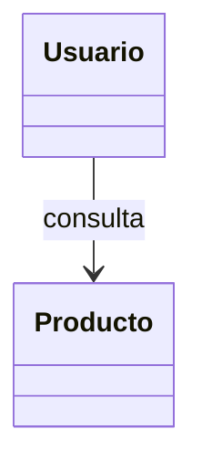
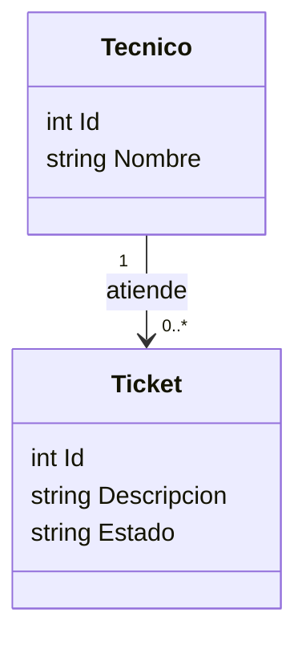
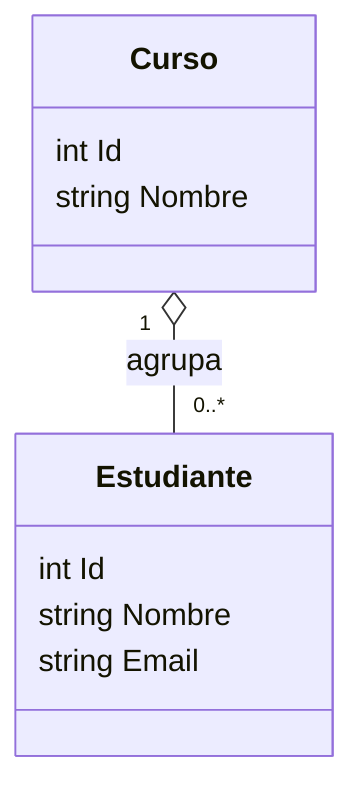
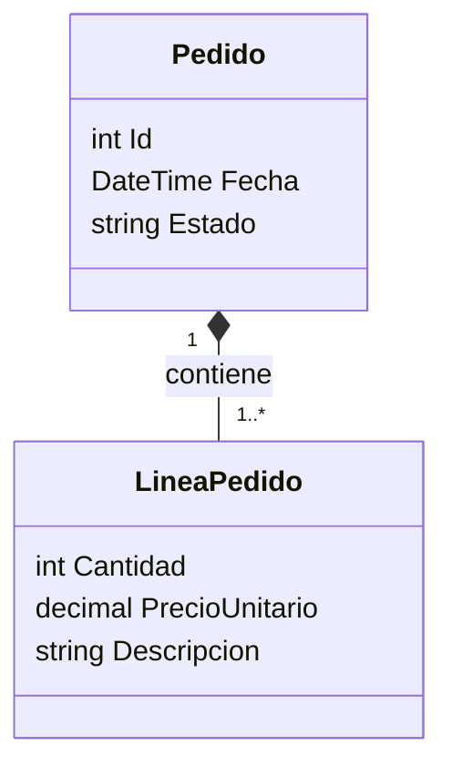
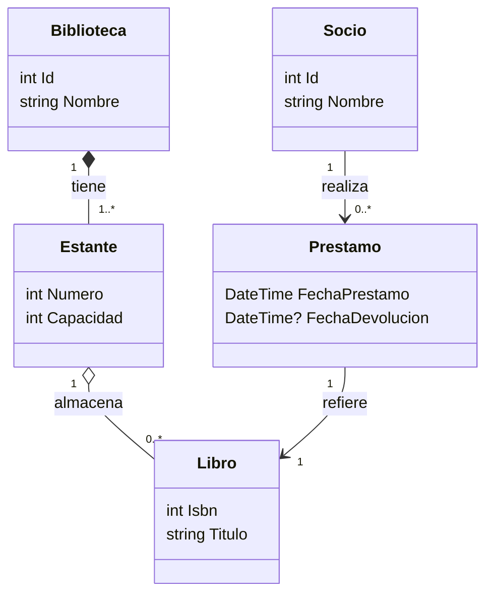
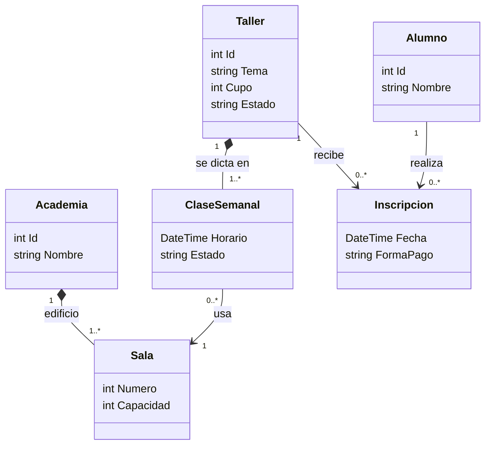

# Programacion 3 2026
## Clase 10

# Hoy

- **Unidad 5** en profundidad: relaciones entre clases
- **Asociacion**, **agregacion** y **composicion**: que son y como se distinguen
- Como se representan en **UML / Mermaid**
- Como se expresan en **C# / .NET 8**
- Cuando elegir una u otra al modelar un dominio
- Errores comunes y como detectarlos antes de escribir codigo

La clase pasada repasamos POO y empezamos a hablar de relaciones entre objetos. Hoy bajamos a tierra dos relaciones que aparecen en casi todos los integradores: **agregacion** y **composicion**. La diferencia parece sutil, pero cambia como se modela, como se persiste y como se valida.

---

# Venimos de aca

- Clase 6.5: actores, procesos, entidades, cardinalidad y una primera mirada a agregacion y composicion
- Clase 9: repaso de POO (clases, objetos, herencia, polimorfismo, encapsulamiento, abstraccion)
- Empezamos a mirar diagramas de clases en Mermaid
- Ya sabemos que un diagrama no se hace "porque queda lindo", sino para tomar decisiones

Hoy avanzamos sobre las **relaciones** entre clases. No alcanza con saber que `Cliente` y `Reserva` "se conectan": importa entender **como** se conectan, **quien depende de quien** y **que pasa cuando uno desaparece**.

---

# Por que importa esta clase

Cuando lleguemos a Entity Framework y arquitectura en capas, vamos a tener que decidir cosas como:

- Cuando borro un `Pedido`, las `LineaPedido` se borran tambien?
- Una `Direccion` puede existir sin el `Cliente` que la usa?
- Un `Curso` que pierde a todos sus `Estudiante` deja de tener sentido?
- Una `Factura` puede compartir `Items` con otra factura?

Esas preguntas no las contesta el ORM. Las contesta **el modelo de dominio**. Por eso conviene tener claro **agregacion vs composicion** **antes** de tocar EF, no despues.

---

# Repaso rapido
## Asociacion como termino general

Cualquier vinculo entre dos clases es una **asociacion**. Es el termino mas general.



Una asociacion responde "estas dos clases se conocen". No dice nada sobre quien crea a quien, ni que pasa cuando uno se elimina.

**Agregacion** y **composicion** son **tipos especiales de asociacion**, mas exigentes en su semantica.

---

# Asociacion simple
## Cuando alcanza con "se conocen"

Hay relaciones donde dos clases colaboran pero ninguna "contiene" a la otra:

- Un `Tecnico` atiende un `Ticket`
- Un `Vendedor` registra un `Pedido`
- Un `Usuario` consulta un `Producto`

Notacion Mermaid:



En C# esto suele ser simplemente una propiedad o un parametro de metodo:

```csharp
public class Tecnico
{
    public int Id { get; set; }
    public string Nombre { get; set; } = "";

    public void Atender(Ticket ticket)
    {
        ticket.Estado = "EnAtencion";
    }
}
```

No hay "contencion": el tecnico no es dueño del ticket ni viceversa. Solo se conocen lo suficiente para colaborar.

---

# Agregacion
## "Tiene", pero la parte vive por su cuenta

La **agregacion** describe una relacion donde una clase **agrupa** o **tiene** objetos de otra clase, pero esos objetos pueden existir **independientemente** del todo.

Caracteristicas:

- La parte **puede existir antes y despues** del todo
- Si el todo desaparece, la parte sigue existiendo
- La parte **puede ser compartida** entre varios "todos"
- Es una relacion **debil** de pertenencia

Ejemplos:

- Un `Curso` tiene `Estudiante`. Si se cierra el curso, los estudiantes siguen existiendo.
- Un `Equipo` agrupa `Jugador`. Si el equipo se disuelve, los jugadores no dejan de ser personas.
- Una `Biblioteca` tiene `Libro` en prestamo. Los libros existen antes y despues de la biblioteca.

En UML: **rombo blanco** del lado del todo.



---

# Agregacion en C#
## Como se ve en codigo

Patron tipico: la parte se crea **fuera** del todo y se le **pasa** como referencia.

```csharp
public class Estudiante
{
    public int Id { get; set; }
    public string Nombre { get; set; } = "";
    public string Email { get; set; } = "";
}

public class Curso
{
    public int Id { get; set; }
    public string Nombre { get; set; } = "";
    public List<Estudiante> Estudiantes { get; } = new();

    public void Inscribir(Estudiante estudiante)
    {
        if (estudiante is null) throw new ArgumentNullException(nameof(estudiante));
        if (Estudiantes.Contains(estudiante)) return;
        Estudiantes.Add(estudiante);
    }

    public void DarDeBaja(Estudiante estudiante)
    {
        Estudiantes.Remove(estudiante);
    }
}
```

Uso:

```csharp
var ana = new Estudiante { Id = 1, Nombre = "Ana", Email = "ana@x.com" };
var luis = new Estudiante { Id = 2, Nombre = "Luis", Email = "luis@x.com" };

var prog3 = new Curso { Id = 100, Nombre = "Programacion 3" };
prog3.Inscribir(ana);
prog3.Inscribir(luis);

var prog2 = new Curso { Id = 101, Nombre = "Programacion 2" };
prog2.Inscribir(ana); // Ana esta en dos cursos: parte compartida
```

Señales de agregacion en codigo:

- El constructor del todo **no crea** las partes
- Las partes se reciben por parametro (en el constructor o en metodos)
- La misma instancia puede aparecer en varios "todos"
- Si se elimina el todo, no hay logica que destruya las partes

---

# Composicion
## La parte no tiene sentido sin el todo

La **composicion** es una relacion **fuerte**: la parte **depende** del todo para existir.

Caracteristicas:

- La parte **se crea junto con** el todo (o a partir de el)
- Si el todo desaparece, la parte tambien
- La parte **no se comparte** entre varios "todos"
- El todo es **dueño** de la parte

Ejemplos:

- Un `Pedido` esta compuesto por `LineaPedido`. Una linea sin pedido no tiene sentido.
- Una `Factura` contiene `ItemFactura`. Los items pertenecen a esa factura.
- Una `Encuesta` esta compuesta por `Pregunta`. Las preguntas mueren con la encuesta.
- Un `Documento` contiene `Parrafo`. El parrafo no existe fuera del documento.

En UML: **rombo negro** del lado del todo.



---

# Composicion en C#
## Como se ve en codigo

Patron tipico: la parte se crea **dentro** del todo y se administra desde ahi.

```csharp
public class LineaPedido
{
    public string Descripcion { get; }
    public int Cantidad { get; }
    public decimal PrecioUnitario { get; }

    internal LineaPedido(string descripcion, int cantidad, decimal precioUnitario)
    {
        if (string.IsNullOrWhiteSpace(descripcion))
            throw new ArgumentException("Descripcion requerida", nameof(descripcion));
        if (cantidad <= 0)
            throw new ArgumentOutOfRangeException(nameof(cantidad));
        if (precioUnitario < 0)
            throw new ArgumentOutOfRangeException(nameof(precioUnitario));

        Descripcion = descripcion;
        Cantidad = cantidad;
        PrecioUnitario = precioUnitario;
    }

    public decimal Subtotal => Cantidad * PrecioUnitario;
}

public class Pedido
{
    private readonly List<LineaPedido> _lineas = new();

    public int Id { get; }
    public DateTime Fecha { get; }
    public string Estado { get; private set; } = "Abierto";
    public IReadOnlyList<LineaPedido> Lineas => _lineas;

    public Pedido(int id, DateTime fecha)
    {
        Id = id;
        Fecha = fecha;
    }

    public void AgregarLinea(string descripcion, int cantidad, decimal precioUnitario)
    {
        if (Estado != "Abierto")
            throw new InvalidOperationException("No se pueden agregar lineas a un pedido cerrado.");

        _lineas.Add(new LineaPedido(descripcion, cantidad, precioUnitario));
    }

    public decimal Total() => _lineas.Sum(l => l.Subtotal);

    public void Cerrar()
    {
        if (_lineas.Count == 0)
            throw new InvalidOperationException("Un pedido sin lineas no se puede cerrar.");
        Estado = "Cerrado";
    }
}
```

Uso:

```csharp
var pedido = new Pedido(1, DateTime.UtcNow);
pedido.AgregarLinea("Cafe", 2, 120m);
pedido.AgregarLinea("Medialuna", 3, 60m);
pedido.Cerrar();

Console.WriteLine(pedido.Total()); // 420
```

Señales de composicion en codigo:

- El constructor de `LineaPedido` es `internal` o privado: solo `Pedido` puede crearla
- La lista de partes esta **encapsulada** (`private readonly List<...>`)
- Se expone solo lectura (`IReadOnlyList<>`)
- Las partes se crean a traves de metodos del todo (`AgregarLinea`)
- El ciclo de vida lo controla el todo

---

# Cara a cara
## Agregacion vs Composicion

| Aspecto | Agregacion | Composicion |
|---|---|---|
| Pertenencia | Debil ("tiene") | Fuerte ("esta compuesto por") |
| Vida de la parte | Independiente del todo | Atada al todo |
| Comparticion | La parte puede ser de varios | Exclusiva de un todo |
| Quien crea la parte | Codigo externo | El todo |
| Si borro el todo | La parte sigue viva | La parte deja de existir |
| Notacion UML | Rombo blanco `o--` | Rombo negro `*--` |
| Pregunta clave | "Puede vivir sin el todo?" | "Tiene sentido sin el todo?" |

---

# Pregunta de decision
## Como elegir entre las dos

Antes de decidir, contestar honestamente:

1. **Si elimino el todo, que pasa con la parte?**
   - Sigue existiendo en el sistema: agregacion
   - Pierde sentido y se borra: composicion

2. **La misma instancia puede aparecer en varios "todos"?**
   - Si: agregacion
   - No, es exclusiva: composicion

3. **Quien crea la parte?**
   - Se recibe ya creada: agregacion
   - La crea el todo: composicion

4. **La parte tiene identidad propia fuera del todo?**
   - Si: agregacion
   - No, su identidad esta atada al todo: composicion

Si dudan entre una y otra, la opcion **mas conservadora** suele ser **asociacion simple**. Composicion y agregacion son **refinamientos** del modelo, no etiquetas obligatorias.

---

# Ejemplo combinado
## Un dominio con las tres relaciones

Veamos un caso real: una **biblioteca** que gestiona prestamos.



Lectura:

- **Composicion** entre `Biblioteca` y `Estante`: si la biblioteca cierra, los estantes ya no existen como entidad del sistema.
- **Agregacion** entre `Estante` y `Libro`: los libros pueden moverse entre estantes o salir en prestamo; siguen existiendo aunque el estante se elimine.
- **Asociacion simple** entre `Socio`, `Prestamo` y `Libro`: el prestamo conecta socio y libro, pero ninguno contiene al otro.

---

# Ejemplo combinado en C#

```csharp
public class Libro
{
    public int Isbn { get; }
    public string Titulo { get; }

    public Libro(int isbn, string titulo)
    {
        Isbn = isbn;
        Titulo = titulo;
    }
}

public class Estante
{
    private readonly List<Libro> _libros = new();

    public int Numero { get; }
    public int Capacidad { get; }
    public IReadOnlyList<Libro> Libros => _libros;

    internal Estante(int numero, int capacidad)
    {
        Numero = numero;
        Capacidad = capacidad;
    }

    public void Almacenar(Libro libro)
    {
        if (_libros.Count >= Capacidad)
            throw new InvalidOperationException("Estante lleno.");
        _libros.Add(libro);
    }

    public void Retirar(Libro libro) => _libros.Remove(libro);
}

public class Biblioteca
{
    private readonly List<Estante> _estantes = new();

    public int Id { get; }
    public string Nombre { get; }
    public IReadOnlyList<Estante> Estantes => _estantes;

    public Biblioteca(int id, string nombre)
    {
        Id = id;
        Nombre = nombre;
    }

    public Estante AgregarEstante(int numero, int capacidad)
    {
        var estante = new Estante(numero, capacidad);
        _estantes.Add(estante);
        return estante;
    }
}
```

Notas:

- `Estante` tiene constructor `internal`: solo se crea desde `Biblioteca` (composicion)
- `Libro` tiene constructor publico y vive afuera: lo guardamos en cualquier estante (agregacion)
- La capacidad del estante es **una regla de negocio que la composicion permite proteger**: solo el estante decide si acepta o no un libro

---

# Errores comunes
## Que evitar al modelar

**Forzar composicion donde alcanza con asociacion.**
No toda relacion "tiene un" es composicion. Si la parte tiene sentido fuera del todo, no es composicion aunque uno la pensara como "contenida".

**Usar agregacion para decorar el diagrama.**
Si no hay diferencia practica con una asociacion simple, no se gana nada con poner un rombo blanco. Conviene reservar agregacion para cuando la **pertenencia** importa.

**Olvidar la cardinalidad.**
`Pedido *-- LineaPedido` sin cardinalidad no aporta. `Pedido "1" *-- "1..*" LineaPedido` dice ademas que un pedido sin lineas no es valido.

**Confundir composicion con herencia.**
Composicion = "tiene un". Herencia = "es un". Un `Pedido` **tiene** lineas; no **es** una linea.

**Composicion en clases anemicas.**
Si `Pedido` expone `List<LineaPedido> Lineas { get; set; }` con setter publico y sin reglas, no hay composicion real: cualquiera puede romper el invariante. Composicion requiere encapsulamiento.

**Crear partes "huerfanas" en composicion.**
Si una `LineaPedido` puede instanciarse y vivir sola sin pedido, el modelo no esta protegiendo la regla.

---

# Conexion con persistencia
## Adelanto de Unidades 6 y 7

Cuando lleguemos a Entity Framework, estas decisiones se traducen a:

- **Composicion** → la entidad hija se borra en cascada con el padre. Suele modelarse como *owned entity* o con `OnDelete(DeleteBehavior.Cascade)`. Sin clave primaria propia visible, o con clave compuesta.
- **Agregacion** → relaciones por clave foranea estandar. Borrar el "todo" **no** borra la parte; a lo sumo deja la FK en null o restringe el borrado.
- **Asociacion simple** → tabla intermedia, claves foraneas comunes, sin reglas de borrado especiales.

Por eso conviene decidir esto **ahora**, modelando el dominio, y no cuando uno ya esta peleando con migraciones.

---

# Como representar en Mermaid
## Sintaxis util

Para tener a mano durante el integrador:

```text
classDiagram
    A --> B          : asociacion simple (A conoce a B)
    A "1" --> "0..*" B : con cardinalidad
    A o-- B          : agregacion (rombo blanco del lado de A)
    A *-- B          : composicion (rombo negro del lado de A)
    A <|-- B         : herencia (B hereda de A)
    A ..> B          : dependencia (A usa B temporalmente)
```

Recordatorios:

- El rombo va del lado del **todo**, no de la parte
- Siempre incluir cardinalidad cuando aporte ("1", "0..*", "1..*", "0..1")
- Etiquetar la relacion ayuda a leer el diagrama ("contiene", "agrupa", "realiza")

---

# Uso de IA en esta clase
## Bueno y riesgoso

Buen uso:

- "Dado este texto de negocio, listame entidades candidatas y proponeme cardinalidades"
- "Para esta relacion, conviene composicion o agregacion? Justifica con la pregunta 'que pasa si borro el todo?'"
- "Convertime este diagrama Mermaid en clases C# con encapsulamiento adecuado para composicion"
- "Detecta si mi clase `Pedido` realmente protege la invariante 'pedido cerrado no admite nuevas lineas'"

Riesgoso:

- Aceptar sin revisar la propuesta de "esto es composicion" sin contrastar con el negocio
- Copiar codigo C# donde las partes tienen setters publicos y se llama "composicion"
- Dejar que la IA decida si una relacion es agregacion o composicion **sin** que ustedes puedan explicarlo

La IA propone; ustedes deciden y defienden.

---

# Actividad principal
## Modelar un caso

Caso de negocio:

```text
Una academia de musica organiza talleres mensuales.
Cada taller tiene un cupo maximo y una lista de inscripciones.
Una inscripcion corresponde a un alumno y a un taller, e incluye fecha y forma de pago.
Cada taller esta organizado en clases semanales con una sala y un horario fijo.
Si el taller se cancela, sus clases se cancelan tambien.
Los alumnos pueden inscribirse a varios talleres a lo largo del año.
Las salas pertenecen al edificio de la academia y se reutilizan entre talleres.
```

Trabajo en equipo (30 minutos):

1. Listar entidades del dominio
2. Para cada par de entidades relacionadas, decidir: asociacion, agregacion o composicion
3. Justificar **por escrito** cada decision con la pregunta "que pasa si borro el todo"
4. Dibujar el diagrama de clases en Mermaid con cardinalidades
5. Implementar en C# **solo** la relacion mas compleja del diagrama (clase + parte) cuidando el encapsulamiento
6. Compilar con `dotnet build` un proyecto chico de consola que cree una instancia y la use

---

# Diagrama de referencia
## Una propuesta posible (no la unica)



Preguntas para discutir:

- Por que `Sala` es composicion respecto a `Academia` y agregacion respecto a `ClaseSemanal`?
- Si un alumno se da de baja, que pasa con sus inscripciones?
- Una inscripcion tiene identidad propia o vive atada al taller?
- Es razonable que `Inscripcion` sea **composicion** del lado de `Taller`?

No hay una unica respuesta correcta. Hay decisiones que **se pueden defender**.

---

# Plantilla de defensa
## Para registrar decisiones del modelo

```text
# Modelo de dominio - decisiones de relacion

## Relacion: <Clase A> -- <Clase B>
- Tipo elegido: asociacion / agregacion / composicion
- Cardinalidad: <ej. 1 a 0..*>
- Justificacion (que pasa si borro el todo):
- Quien crea la parte:
- La parte se puede compartir:
- Pregunta pendiente al negocio:
```

Esta plantilla puede vivir en `ia_docs` o junto al diagrama del integrador. Cuando lleguen a EF, la van a agradecer.

---

# Mini practica de revision
## Detectar errores en codigo

Miren este fragmento. Que problemas tiene si se afirma que es **composicion**?

```csharp
public class Encuesta
{
    public int Id { get; set; }
    public List<Pregunta> Preguntas { get; set; } = new();
}

public class Pregunta
{
    public int Id { get; set; }
    public string Texto { get; set; } = "";
}
```

Problemas:

- `Preguntas` tiene setter publico: cualquiera puede reemplazar la lista entera
- No hay validacion al agregar preguntas
- `Pregunta` puede crearse fuera de `Encuesta` y compartirse: no hay composicion real
- No hay metodo del lado de `Encuesta` que controle el ciclo de vida

Mejora minima alineada con composicion:

```csharp
public class Pregunta
{
    public string Texto { get; }

    internal Pregunta(string texto)
    {
        if (string.IsNullOrWhiteSpace(texto))
            throw new ArgumentException("Texto requerido", nameof(texto));
        Texto = texto;
    }
}

public class Encuesta
{
    private readonly List<Pregunta> _preguntas = new();

    public int Id { get; }
    public IReadOnlyList<Pregunta> Preguntas => _preguntas;

    public Encuesta(int id) { Id = id; }

    public void AgregarPregunta(string texto)
    {
        if (_preguntas.Count >= 50)
            throw new InvalidOperationException("Maximo de preguntas alcanzado.");
        _preguntas.Add(new Pregunta(texto));
    }
}
```

Diferencias clave: ciclo de vida controlado, invariantes protegidas, parte no instanciable desde afuera.

---

# Cierre

- Toda asociacion describe que dos clases se conocen
- **Agregacion** = "tiene", pero la parte vive por su cuenta y puede compartirse
- **Composicion** = "esta compuesto por", la parte depende del todo y muere con el
- La pregunta de oro: **que pasa si borro el todo?**
- En C# la diferencia se nota en **quien crea la parte** y en **el encapsulamiento** del todo
- Estas decisiones de modelo van a impactar directo cuando lleguemos a EF y arquitectura en capas

Un buen diagrama de clases no se mide por cantidad de cajas. Se mide por **cuantas decisiones de negocio queda visibles**.

---

# Lo que sigue

- Cierre de **Unidad 5** con casos de uso, interacciones y diagramas de secuencia
- Despues entramos a **Unidad 6:** persistencia con ADO.NET
- Y luego **Unidad 7:** Entity Framework, donde estas decisiones se traducen a configuracion del ORM
- Para el integrador: empezar a registrar las decisiones de relacion del dominio que esten modelando

Si pueden defender por que cada relacion es como es, el diagrama esta listo. Si no, todavia falta una conversacion con el negocio.
