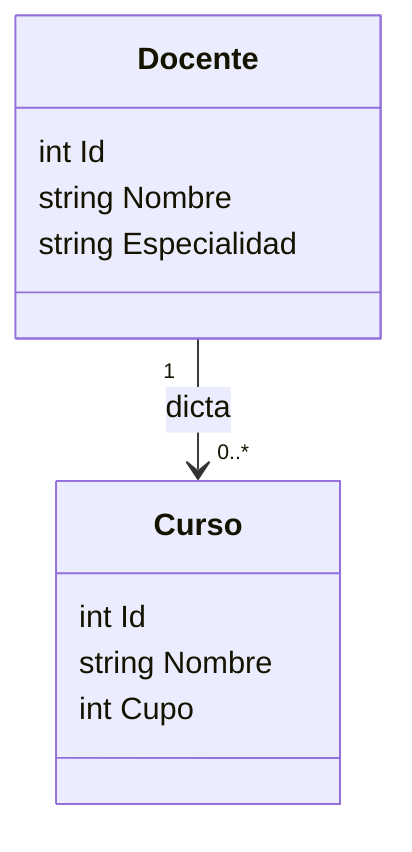
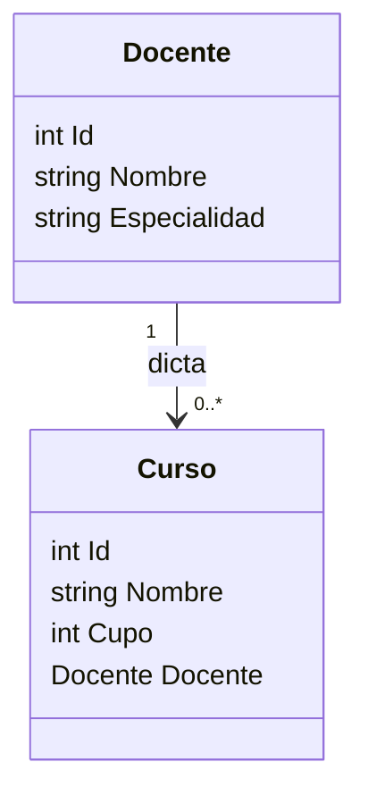
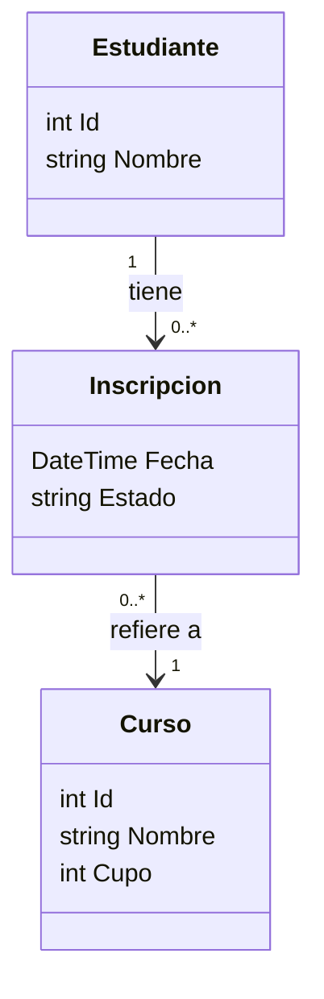

# Programación 3 2026 — Clase 14

## Unidad 5 · Instancias y relaciones en memoria: del diagrama al código

> **.NET 8 · C# · Consola**

En la Unidad 5 aprendimos a modelar dominios con diagramas: clases, asociaciones, cardinalidades, agregación y composición. En las Unidades 6 y 7 empujamos esos datos a una base con ADO.NET y luego con Entity Framework. Pero hay un paso en el medio que no hicimos explícito: **cómo se implementan esas relaciones en memoria pura, sin base de datos y sin ORM**.

Hoy cerramos ese hueco. Arrancamos desde el diagrama, escribimos las clases en C#, creamos objetos reales en una app de consola y los relacionamos en memoria. Si ese paso queda claro, todo lo que hace Entity Framework por nosotros —navigation properties, change tracking, borrado en cascada— va a tener sentido de fondo, porque es exactamente lo mismo que hoy hacemos a mano.

El proyecto que se construye a lo largo de esta clase es una app de consola mínima que puede armarse desde cero con:

```bash
dotnet new console -n RelacionesEnMemoria
cd RelacionesEnMemoria
dotnet run
```

---

## 1. Clase e instancia: el molde y el objeto

El primer concepto que hay que tener clavado antes de hablar de relaciones es la diferencia entre **clase** e **instancia**.

Una **clase** es una descripción: qué propiedades tiene un tipo de dato, qué puede hacer. Existe en el código fuente. Es el **molde**.

Una **instancia** es un objeto concreto, creado en memoria a partir de ese molde cuando el programa corre. Puede haber muchas instancias de la misma clase, cada una con sus propios valores y ocupando su propio espacio en memoria.

```csharp
// CLASE: el molde. Existe en el .cs, no en memoria de ejecución.
public class Estudiante
{
    public int Id { get; set; }
    public string Nombre { get; set; } = "";
}

// INSTANCIAS: objetos concretos creados con `new`.
Estudiante ana  = new Estudiante { Id = 1, Nombre = "Ana García" };
Estudiante luis = new Estudiante { Id = 2, Nombre = "Luis Martínez" };
```

`ana` y `luis` son dos instancias distintas de la misma clase `Estudiante`. Ocupan lugares separados en memoria y se pueden modificar de forma independiente. Si le cambiamos el nombre a `ana`, `luis` no se ve afectado.

El operador `new` es el que crea la instancia: reserva espacio en memoria, inicializa las propiedades y devuelve una **referencia** al objeto creado. Cuando escribimos `Estudiante ana = new Estudiante(...)`, la variable `ana` no guarda el objeto en sí, sino una **dirección de memoria** que apunta a él.

Este detalle importa para las relaciones: cuando ponemos un `Estudiante` dentro de un `Curso`, lo que viaja no es una copia del estudiante, sino esa referencia. Modificar el objeto desde cualquier punto del programa modifica el mismo objeto.

> **La distinción clave de esta clase:** un diagrama de clases describe **tipos** (moldes). El `new` convierte esos tipos en **instancias reales** que viven en memoria y se pueden relacionar entre sí.

---

## 2. Relación 1 a N: un docente dicta muchos cursos

Empecemos con la relación más común. En el diagrama, "un docente dicta muchos cursos" se ve así:



La cardinalidad `1` a `0..*` dice: un docente puede dictar cero o más cursos. Un curso tiene exactamente un docente. La pregunta es: **¿cómo se implementa esto en C#?**

La respuesta es `List<Curso>` dentro de `Docente`:

```csharp
public class Curso
{
    public int Id { get; set; }
    public string Nombre { get; set; } = "";
    public int Cupo { get; set; }
}

public class Docente
{
    public int Id { get; set; }
    public string Nombre { get; set; } = "";
    public string Especialidad { get; set; } = "";

    // La relación 1-N se implementa como una lista de instancias del lado "N"
    public List<Curso> Cursos { get; set; } = new();
}
```

Y así se usa en consola:

```csharp
// Instanciamos los objetos
Docente lucia = new Docente { Id = 1, Nombre = "Lucía Rodríguez", Especialidad = "Bases de datos" };

Curso db1 = new Curso { Id = 102, Nombre = "Base de datos 1", Cupo = 25 };
Curso db2 = new Curso { Id = 103, Nombre = "Base de datos 2", Cupo = 20 };

// Establecemos la relación: agregamos las instancias de Curso a la lista de Docente
lucia.Cursos.Add(db1);
lucia.Cursos.Add(db2);

// Navegamos la relación: vemos qué cursos dicta Lucía
Console.WriteLine($"Cursos de {lucia.Nombre}:");
foreach (Curso c in lucia.Cursos)
{
    Console.WriteLine($"  - {c.Nombre} (cupo: {c.Cupo})");
}
```

Resultado:

```
Cursos de Lucía Rodríguez:
  - Base de datos 1 (cupo: 25)
  - Base de datos 2 (cupo: 20)
```

La lista `lucia.Cursos` **contiene referencias** a los objetos `db1` y `db2`. No son copias. Si más adelante hacemos `db1.Cupo = 40`, ese cambio se refleja al recorrer `lucia.Cursos` de nuevo: es el mismo objeto en memoria.

---

## 3. Navegar hacia el padre: la referencia inversa

Con el código de arriba podemos ir de `Docente` a sus `Cursos`, pero no podemos ir de `Curso` a su `Docente`. Si necesitamos esa navegación en ambas direcciones, agregamos una propiedad de referencia en `Curso`:



```csharp
public class Curso
{
    public int Id { get; set; }
    public string Nombre { get; set; } = "";
    public int Cupo { get; set; }

    // Referencia al padre: permite navegar desde el hijo hacia el padre
    public Docente? Docente { get; set; }
}
```

Al agregar un curso a la lista del docente, también seteamos la referencia inversa:

```csharp
// Establecemos la relación en ambas direcciones
db1.Docente = lucia;
lucia.Cursos.Add(db1);

db2.Docente = lucia;
lucia.Cursos.Add(db2);

// Ahora navegamos en ambas direcciones
Console.WriteLine($"El curso '{db1.Nombre}' lo dicta {db1.Docente?.Nombre}");
```

Esto es manual: nada en el lenguaje garantiza que si hacemos `lucia.Cursos.Add(db1)` también quede seteado `db1.Docente`. Hay que hacerlo explícitamente. En Entity Framework esa sincronización la hace el ORM en automático; acá la hacemos nosotros.

> **Esto es exactamente lo que EF llama *navigation properties*.** Cuando en EF ponemos `public Docente Docente { get; set; }` en la clase `Curso` y `public List<Curso> Cursos { get; set; }` en `Docente`, EF genera el SQL para recuperar y mantener esa relación. Lo que hacemos acá a mano, EF lo automatiza contra la base de datos.

---

## 4. El problema de las relaciones N a N

Una relación 1 a N es directa: una lista del lado "N" resuelve todo. Pero cuando la relación es de **muchos a muchos**, la cosa se complica.

Un estudiante puede inscribirse en muchos cursos. Un curso puede tener muchos estudiantes. Eso es N a N.

El primer impulso es poner una lista en cada lado:

```csharp
// Primer intento — incompleto
public class Estudiante
{
    public int Id { get; set; }
    public string Nombre { get; set; } = "";
    public List<Curso> Cursos { get; set; } = new();
}

public class Curso
{
    public int Id { get; set; }
    public string Nombre { get; set; } = "";
    public int Cupo { get; set; }
    public List<Estudiante> Estudiantes { get; set; } = new();
}
```

Esto funciona mecánicamente, pero tiene dos problemas que en un sistema real se convierten en bugs:

**Problema 1 — Consistencia manual.** Si agrego a `ana` en `prog3.Estudiantes`, también tengo que acordarme de agregar `prog3` en `ana.Cursos`. Nada en el código lo garantiza. Si me olvido uno, los datos quedan inconsistentes: el curso dice que Ana está inscripta pero Ana no sabe que está en ese curso.

**Problema 2 — Sin lugar para los datos de la relación.** La inscripción tiene información propia: la fecha en que se inscribió el estudiante, si está activa o dada de baja, el número de lista. ¿Dónde guardo eso? No en `Estudiante` (es data de la relación, no del estudiante) ni en `Curso` (igual). No tiene un lugar natural.

La solución es **materializar la relación como una clase propia**.

---

## 5. La clase pivote: `Inscripcion`

Cuando una relación N a N tiene datos propios —o cuando queremos que la consistencia sea más fácil de manejar— creamos una **clase pivote** que representa la relación en sí misma.



La `Inscripcion` guarda una referencia al `Estudiante` y una referencia al `Curso`. La relación N a N original queda expresada como **dos relaciones 1 a N**: un estudiante tiene muchas inscripciones, un curso tiene muchas inscripciones.

```csharp
public class Estudiante
{
    public int Id { get; set; }
    public string Nombre { get; set; } = "";

    // Un estudiante tiene muchas inscripciones (1-N)
    public List<Inscripcion> Inscripciones { get; set; } = new();
}

public class Inscripcion
{
    // Datos propios de la relación
    public DateTime Fecha { get; set; }
    public string Estado { get; set; } = "Activa";

    // Referencias a los dos extremos del N-N
    public Estudiante Estudiante { get; set; } = null!;
    public Curso Curso { get; set; } = null!;
}

public class Curso
{
    public int Id { get; set; }
    public string Nombre { get; set; } = "";
    public int Cupo { get; set; }
    public Docente? Docente { get; set; }

    // Un curso tiene muchas inscripciones (1-N)
    public List<Inscripcion> Inscripciones { get; set; } = new();
}
```

Para inscribir a un estudiante en un curso, se crea una instancia de `Inscripcion` y se agrega a ambas listas:

```csharp
// Ana se inscribe en db1
Inscripcion ins1 = new Inscripcion
{
    Fecha = new DateTime(2026, 3, 1),
    Estado = "Activa",
    Estudiante = ana,
    Curso = db1
};
ana.Inscripciones.Add(ins1);   // ana sabe que está inscripta
db1.Inscripciones.Add(ins1);   // db1 sabe que ana está inscripta

// Luis se inscribe en db1 y en db2
Inscripcion ins2 = new Inscripcion
{
    Fecha = new DateTime(2026, 3, 2),
    Estado = "Activa",
    Estudiante = luis,
    Curso = db1
};
luis.Inscripciones.Add(ins2);
db1.Inscripciones.Add(ins2);

Inscripcion ins3 = new Inscripcion
{
    Fecha = new DateTime(2026, 3, 5),
    Estado = "Activa",
    Estudiante = ana,
    Curso = db2
};
ana.Inscripciones.Add(ins3);
db2.Inscripciones.Add(ins3);
```

---

## 6. Navegar el N a N en ambas direcciones

Una vez que tenemos las inscripciones cargadas, podemos navegar desde cualquier extremo de la relación:

```csharp
// Desde el estudiante: ¿en qué cursos está Ana?
Console.WriteLine($"Cursos de {ana.Nombre}:");
foreach (Inscripcion ins in ana.Inscripciones)
{
    Console.WriteLine($"  - {ins.Curso.Nombre} (inscripta el {ins.Fecha:dd/MM/yyyy})");
}

// Desde el curso: ¿quiénes están en db1?
Console.WriteLine($"\nEstudiantes en '{db1.Nombre}':");
foreach (Inscripcion ins in db1.Inscripciones)
{
    Console.WriteLine($"  - {ins.Estudiante.Nombre} ({ins.Estado})");
}

// Combinando 1-N y N-N: cursos de Lucía con su cantidad de inscriptos
Console.WriteLine($"\nCursos de {lucia.Nombre}:");
foreach (Curso c in lucia.Cursos)
{
    Console.WriteLine($"  - {c.Nombre}: {c.Inscripciones.Count} inscriptos");
}
```

Resultado:

```
Cursos de Ana García:
  - Base de datos 1 (inscripta el 01/03/2026)
  - Base de datos 2 (inscripta el 05/03/2026)

Estudiantes en 'Base de datos 1':
  - Ana García (Activa)
  - Luis Martínez (Activa)

Cursos de Lucía Rodríguez:
  - Base de datos 1: 2 inscriptos
  - Base de datos 2: 1 inscriptos
```

La navegación sigue siempre el mismo patrón: **objeto → lista de objetos intermedios → propiedad del otro extremo**. Lo que en SQL serían dos joins, en memoria es recorrer dos niveles de listas.

---

## 7. Del diagrama al código: la traducción directa

La siguiente tabla resume la conversión de diagrama a código. Cuando se está frente a un diagrama, estas son las reglas:

| En el diagrama | En C# |
|---|---|
| Clase `Docente` | `public class Docente { ... }` |
| Propiedad `string Nombre` | `public string Nombre { get; set; } = "";` |
| Relación `Docente "1" --> "0..*" Curso` | `public List<Curso> Cursos { get; set; } = new();` en `Docente` |
| Navegación inversa (`Curso` conoce a `Docente`) | `public Docente? Docente { get; set; }` en `Curso` |
| Relación N a N con datos (`Estudiante ↔ Curso`) | Clase pivote `Inscripcion` con `Estudiante` y `Curso` dentro; listas en ambos extremos |
| Instancia de `Docente` | `Docente lucia = new Docente { Id = 1, Nombre = "..." };` |
| Establecer relación 1-N | `lucia.Cursos.Add(db1); db1.Docente = lucia;` |
| Establecer relación N-N | `Inscripcion ins = new Inscripcion { Estudiante = ana, Curso = db1 }; ana.Inscripciones.Add(ins); db1.Inscripciones.Add(ins);` |

---

## 8. El programa completo

Para crear y correr el ejemplo desde cero:

```bash
dotnet new console -n RelacionesEnMemoria
cd RelacionesEnMemoria
# Reemplazar el contenido de Program.cs con el código de abajo
dotnet run
```

```csharp
// ---- Clases del dominio ----

public class Docente
{
    public int Id { get; set; }
    public string Nombre { get; set; } = "";
    public string Especialidad { get; set; } = "";
    public List<Curso> Cursos { get; set; } = new();
}

public class Curso
{
    public int Id { get; set; }
    public string Nombre { get; set; } = "";
    public int Cupo { get; set; }
    public Docente? Docente { get; set; }
    public List<Inscripcion> Inscripciones { get; set; } = new();
}

public class Estudiante
{
    public int Id { get; set; }
    public string Nombre { get; set; } = "";
    public List<Inscripcion> Inscripciones { get; set; } = new();
}

public class Inscripcion
{
    public DateTime Fecha { get; set; }
    public string Estado { get; set; } = "Activa";
    public Estudiante Estudiante { get; set; } = null!;
    public Curso Curso { get; set; } = null!;
}

// ---- Instancias y relaciones ----

Docente lucia = new Docente { Id = 1, Nombre = "Lucía Rodríguez", Especialidad = "Bases de datos" };

Curso db1 = new Curso { Id = 102, Nombre = "Base de datos 1", Cupo = 25 };
Curso db2 = new Curso { Id = 103, Nombre = "Base de datos 2", Cupo = 20 };

// 1-N: docente dicta cursos
db1.Docente = lucia; lucia.Cursos.Add(db1);
db2.Docente = lucia; lucia.Cursos.Add(db2);

Estudiante ana  = new Estudiante { Id = 1, Nombre = "Ana García" };
Estudiante luis = new Estudiante { Id = 2, Nombre = "Luis Martínez" };

// N-N: inscripciones
Inscripcion ins1 = new Inscripcion { Fecha = new DateTime(2026, 3, 1), Estudiante = ana,  Curso = db1 };
ana.Inscripciones.Add(ins1);  db1.Inscripciones.Add(ins1);

Inscripcion ins2 = new Inscripcion { Fecha = new DateTime(2026, 3, 2), Estudiante = luis, Curso = db1 };
luis.Inscripciones.Add(ins2); db1.Inscripciones.Add(ins2);

Inscripcion ins3 = new Inscripcion { Fecha = new DateTime(2026, 3, 5), Estudiante = ana,  Curso = db2 };
ana.Inscripciones.Add(ins3);  db2.Inscripciones.Add(ins3);

// ---- Navegación ----

Console.WriteLine($"Cursos de {lucia.Nombre}:");
foreach (Curso c in lucia.Cursos)
{
    Console.WriteLine($"  {c.Nombre} — {c.Inscripciones.Count} inscriptos");
}

Console.WriteLine($"\nCursos de {ana.Nombre}:");
foreach (Inscripcion ins in ana.Inscripciones)
{
    Console.WriteLine($"  {ins.Curso.Nombre} (docente: {ins.Curso.Docente?.Nombre})");
}

Console.WriteLine($"\nEstudiantes en '{db1.Nombre}':");
foreach (Inscripcion ins in db1.Inscripciones)
{
    Console.WriteLine($"  {ins.Estudiante.Nombre} — inscripto el {ins.Fecha:dd/MM/yyyy}");
}
```

---

## 9. Conexión con Entity Framework

Todo lo que hicimos hoy en memoria, Entity Framework lo hace automáticamente contra una base de datos. La comparación es directa:

| En memoria (hoy) | Con Entity Framework |
|---|---|
| `List<Curso> Cursos` en `Docente` | Navigation property — EF genera el JOIN |
| `Docente? Docente` en `Curso` | FK + navigation property — EF genera la columna `DocenteId` |
| Clase `Inscripcion` con referencias | Tabla `Inscripciones` con columnas `EstudianteId` y `CursoId` |
| `lucia.Cursos.Add(db1)` | `_context.Cursos.Add(db1)` + `_context.SaveChanges()` |
| Recorrer `lucia.Cursos` en memoria | EF carga la lista con un `SELECT ... JOIN` |

La diferencia es que en memoria los datos se pierden cuando termina el programa. Con EF los mismos objetos y las mismas relaciones se guardan en tablas, se cargan de nuevo la próxima vez, y EF sincroniza el estado. Pero el **modelo de clases** es exactamente el mismo: las propiedades de navegación y las listas de objetos relacionados.

Cuando en la Unidad 8 (Arquitectura en capas) tengamos que diseñar el dominio de una aplicación, el ejercicio va a ser exactamente este: dibujar el diagrama, identificar si cada relación es 1-N o N-N, y traducirlo a C# según las reglas de la tabla del ítem 7.

---

## Para practicar

**Ejercicio 1 — Agregar `Departamento`:** Creá una clase `Departamento` con `Id`, `Nombre` y una lista de `Docente`. Modelá la relación en un diagrama Mermaid (¿qué cardinalidad tiene?), luego implementala en el programa. Un departamento tiene muchos docentes; un docente pertenece a un departamento.

**Ejercicio 2 — Nueva relación N a N:** Agregá una clase `Tema` (por ejemplo: `SQL`, `Modelado relacional`, `Normalización`) y una clase pivote `TemaCurso` que represente qué temas abarca cada curso. Un curso puede cubrir varios temas; un tema puede aparecer en varios cursos. Dibujá el diagrama, implementalo y cargá tres cursos con sus temas.

**Ejercicio 3 — Consultas sobre las relaciones:** Con el programa completo del ítem 8, escribí el código para responder estas preguntas usando `foreach` o LINQ:
- ¿Cuántos estudiantes distintos están inscriptos en al menos un curso de Lucía?
- ¿Hay algún estudiante inscripto en todos los cursos disponibles?
- ¿Cuál es el curso con más inscripciones?
