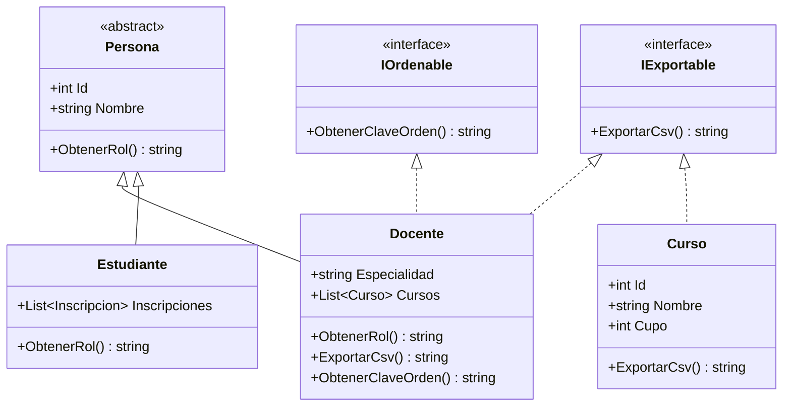
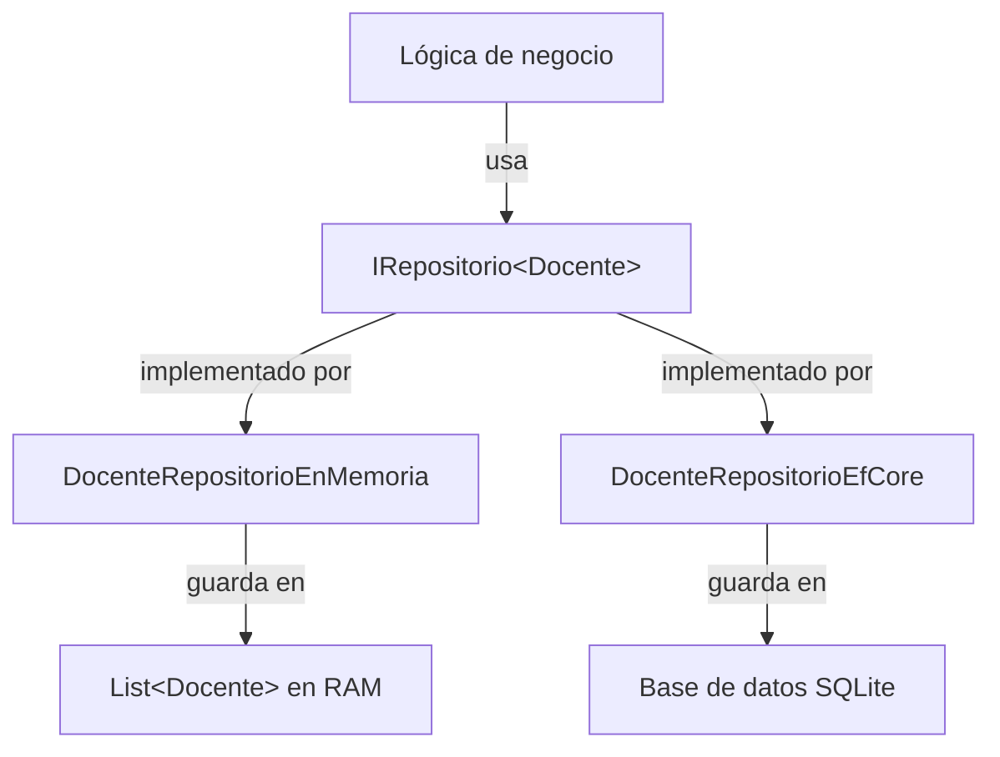

# Programación 3 2026 — Clase 16

## Unidad 5 · Interfaces: el contrato que las clases deben cumplir

> **.NET 8 · C# · Consola**

La clase pasada terminamos de construir la jerarquía de `Persona` con clases abstractas. Vimos que una clase abstracta sirve para dos cosas a la vez: compartir código común entre subclases (las propiedades `Id` y `Nombre`) y obligar a esas subclases a implementar ciertos métodos (`ObtenerRol()`). El compilador se encarga de que nadie se olvide. Hoy damos el siguiente paso, que es el concepto que aparece literalmente en toda arquitectura de software real: **las interfaces**.

Si las clases abstractas resuelven el problema de "tengo clases relacionadas por herencia que necesitan compartir comportamiento", las interfaces resuelven un problema distinto: "tengo clases que **no** están relacionadas por herencia y necesito garantizar que todas hacen algo de la misma manera". Arrancamos con ese problema concreto.

---

## 1. El problema motivador: ¿qué tienen en común `Docente` y `Curso`?

Imaginá que el sistema `RelacionesEnMemoria` tiene un nuevo requerimiento: **exportar datos a CSV**. El director quiere poder volcar la lista de docentes y la lista de cursos a un archivo de texto con columnas separadas por punto y coma, para abrirlo en Excel.

Mirá los dos tipos que hay que exportar:

```
Docente → hereda de Persona → hereda de object
Curso   → hereda de object
```

`Docente` y `Curso` no tienen ningún ancestro en común salvo `object`, que es la raíz de todo en .NET. No tiene sentido crear una clase abstracta común entre ellos: un `Docente` y un `Curso` no son "lo mismo" en ningún sentido del dominio.

Pero los dos necesitan tener un método `ExportarCsv()`. ¿Cómo garantizamos que ambos lo implementen, sin que hereden de la misma clase base?

El primer intento incorrecto sería simplemente agregar el método a cada clase por separado y confiar en que nadie se olvida:

```csharp
// Intento incorrecto: no hay nada que obligue a implementarlo
public class Docente : Persona
{
    public string Especialidad { get; set; } = "";
    public List<Curso> Cursos { get; set; } = new();
    public override string ObtenerRol() => $"Docente de {Especialidad}";

    // Nadie te obliga a poner esto. Y si mañana viene Inscripcion,
    // nadie te avisa que también debería tenerlo.
    public string ExportarCsv() => $"{Id};{Nombre};{Especialidad}";
}

public class Curso
{
    public int Id { get; set; }
    public string Nombre { get; set; } = "";
    public int Cupo { get; set; }
    public Docente? Docente { get; set; }
    public List<Inscripcion> Inscripciones { get; set; } = new();
    public List<TemaCurso> TemaCursos { get; set; } = new();

    // Tampoco hay nada que lo exija. Podés olvidarlo.
    public string ExportarCsv() => $"{Id};{Nombre};{Cupo}";
}
```

El problema es que si dentro de seis meses agregás `Inscripcion` al sistema y querés exportarla, nadie te avisa que también debería tener `ExportarCsv()`. Y cuando alguien intente escribir código genérico que exporte "cualquier cosa exportable", no puede, porque no hay un tipo común que garantice la existencia del método.

Eso es exactamente lo que resuelve una **interfaz**.

---

## 2. ¿Qué es una interfaz?

Una interfaz es un **contrato puro**: una lista de miembros (métodos, propiedades, eventos) que una clase promete implementar. No contiene implementación propia. No tiene campos ni constructores. Es solo la firma de lo que la clase debe tener.

En C# se declara con la palabra clave `interface` y, por convención, el nombre empieza con `I` mayúscula:

```csharp
// IExportable.cs
namespace RelacionesEnMemoria;

public interface IExportable
{
    string ExportarCsv();
}
```

Eso es todo. La interfaz dice: "cualquier clase que me implemente debe tener un método `ExportarCsv()` que devuelva un `string`." No dice cómo hacerlo. Eso lo decide cada clase.

> **Nota:** la `I` inicial es una convención de C# para nombrar interfaces. En el framework de .NET la vas a ver en todos lados: `IEnumerable`, `IComparable`, `IDisposable`, `IRepository`. Es la señal visual de que estás mirando un contrato, no una clase.

Si una clase declara implementar una interfaz pero no tiene el método que la interfaz exige, el compilador falla de inmediato:

```
Error CS0535: 'Docente' does not implement interface member 'IExportable.ExportarCsv()'
```

El mismo mecanismo que vimos con los métodos abstractos, pero ahora sin jerarquía de herencia. Si el contrato dice que tiene que estar, tiene que estar.

---

## 3. ¿En qué se diferencia de una clase abstracta?

Esta comparación aparece en todos los exámenes, así que vale la pena entenderla bien:

| | Clase abstracta | Interfaz |
|---|---|---|
| Puede tener implementación de métodos | ✅ Sí | ❌ No (salvo default interface methods, C# 8+) |
| Puede tener campos / variables de instancia | ✅ Sí | ❌ No |
| Puede tener constructor | ✅ Sí | ❌ No |
| Una clase puede heredar de varias | ❌ No (solo una clase base) | ✅ Sí (múltiples interfaces) |
| Representa una relación "es un" | ✅ Sí (`Docente` es una `Persona`) | No exactamente: representa "cumple con" |
| Garantiza implementación a las subclases | ✅ Métodos abstractos | ✅ Todos sus miembros |
| Se usa para compartir código | ✅ Principalmente | ❌ No |
| Se usa para definir un contrato | ✅ Secundariamente | ✅ Principalmente |

> **Nota sobre default interface methods:** a partir de C# 8 las interfaces pueden tener implementaciones por defecto. Es una feature avanzada que no vamos a usar en este curso, pero que vas a ver mencionada en Google o en la documentación oficial. Por ahora, quedate con la definición clásica: la interfaz solo define el contrato, no la implementación.

Dicho de otra manera:

- La **clase abstracta** dice: "sos una variante de mí, compartimos código, pero tenés que implementar estas partes".
- La **interfaz** dice: "no me importa de dónde venís, solo prometé que vas a tener estos métodos".

Un `Docente` hereda de `Persona` porque **es** una persona. Un `Docente` implementa `IExportable` porque **puede** exportarse. Son dos relaciones completamente distintas.

---

## 4. Implementar una interfaz en C#

La sintaxis para que una clase implemente una interfaz usa el mismo `:` que la herencia, separando con comas si hay varias:

```csharp
// Docente.cs
namespace RelacionesEnMemoria;

public class Docente : Persona, IExportable
{
    public string Especialidad { get; set; } = "";
    public List<Curso> Cursos { get; set; } = new();

    public override string ObtenerRol() => $"Docente de {Especialidad}";

    // Implementación del contrato IExportable
    public string ExportarCsv() => $"{Id};{Nombre};{Especialidad}";
}
```

```csharp
// Curso.cs
namespace RelacionesEnMemoria;

public class Curso : IExportable
{
    public int Id { get; set; }
    public string Nombre { get; set; } = "";
    public int Cupo { get; set; }
    public Docente? Docente { get; set; }
    public List<Inscripcion> Inscripciones { get; set; } = new();
    public List<TemaCurso> TemaCursos { get; set; } = new();

    // Implementación del contrato IExportable
    public string ExportarCsv() => $"{Id};{Nombre};{Cupo};{Docente?.Nombre ?? "Sin docente"}";
}
```

Fijate en `Docente : Persona, IExportable`. Ahí está la diferencia clave con la herencia de clases: una clase puede implementar **todas las interfaces que quiera**, pero solo puede heredar de **una clase base**. En C# no existe la herencia múltiple de clases. Pero de interfaces, sí.

---

## 5. Una clase puede implementar múltiples interfaces

Supongamos que además de exportar a CSV, queremos que algunas clases soporten **comparación por nombre** para poder ordenarlas. Definimos una segunda interfaz:

```csharp
// IOrdenable.cs
namespace RelacionesEnMemoria;

public interface IOrdenable
{
    string ObtenerClaveOrden();
}
```

Ahora `Docente` puede implementar las dos:

```csharp
public class Docente : Persona, IExportable, IOrdenable
{
    public string Especialidad { get; set; } = "";
    public List<Curso> Cursos { get; set; } = new();

    public override string ObtenerRol() => $"Docente de {Especialidad}";

    public string ExportarCsv() => $"{Id};{Nombre};{Especialidad}";

    public string ObtenerClaveOrden() => Nombre;
}
```

¿Por qué esto es importante? Porque en C# una clase ya ocupa su "cupo" de herencia: `Docente` hereda de `Persona` y no puede heredar de nada más. Las interfaces son la única manera de que una clase "pertenezca" a múltiples contratos al mismo tiempo.



En Mermaid la flecha `<|--` es herencia y `<|..` es implementación de interfaz. Guardá esa notación.

> **Punto de verificación:** antes de seguir, confirmá que tu proyecto compila con `Docente : Persona, IExportable, IOrdenable`. Si declarás esa firma pero te falta alguno de los dos métodos (`ExportarCsv` o `ObtenerClaveOrden`), el compilador te lo dice con el error `CS0535`. Eso es exactamente el contrato funcionando. Arreglá el error antes de avanzar a la sección siguiente.

---

## 6. Uso polimórfico: `List<IExportable>`

Acá viene la ganancia real. Una vez que `Docente` y `Curso` implementan `IExportable`, puedo crear una lista del tipo de la interfaz y poner objetos de ambos tipos adentro:

```csharp
// Program.cs (fragmento nuevo)

// Suponemos que lucia es un Docente con Id=1,
// ana es un Estudiante con Id=2, luis es un Estudiante con Id=3,
// db1 es un Curso con Id=101, db2 es un Curso con Id=102.

List<IExportable> exportables = new List<IExportable>();
exportables.Add(lucia);   // Docente
exportables.Add(ana);     // Estudiante (también implementa IExportable)
exportables.Add(luis);    // Estudiante
exportables.Add(db1);     // Curso
exportables.Add(db2);     // Curso

Console.WriteLine("\n=== Exportación CSV ===");
foreach (IExportable item in exportables)
{
    Console.WriteLine(item.ExportarCsv());
}
```

Resultado esperado:

```
=== Exportación CSV ===
1;Lucía Rodríguez;Bases de datos
2;Ana García
3;Luis Martínez
101;Base de datos 1;25;Lucía Rodríguez
102;Base de datos 2;20;Lucía Rodríguez
```

`List<IExportable>` acepta cualquier objeto cuya clase implemente `IExportable`, sin importar su jerarquía de herencia. Es polimorfismo sin herencia: el tipo de la variable es la interfaz, el tipo real del objeto puede ser cualquier cosa que cumpla el contrato.

Ahora si mañana `Inscripcion` también implementa `IExportable`, podés agregarla a esa lista sin tocar nada más. El `foreach` sigue igual. La función que escribe el CSV sigue igual. Solo se agrega un tipo nuevo al ecosistema.

> **Nota:** este es el principio **Open/Closed** (abierto para extensión, cerrado para modificación). Es uno de los principios SOLID que vas a escuchar nombrar constantemente en el mundo profesional. Las interfaces son la herramienta central para lograrlo.

---

## 7. Interfaces del framework que ya usabas sin saberlo

No inventamos nada nuevo. El framework de .NET está lleno de interfaces que ya usaste sin saber que lo eran.

### `IEnumerable<T>`

Cada vez que hacés un `foreach` sobre una lista, el compilador necesita que el objeto implemente `IEnumerable<T>`. Eso es lo que hace que `List<T>`, los arrays, y cualquier colección funcionen con `foreach`: todos implementan `IEnumerable<T>`.

```csharp
// Esto funciona porque List<Persona> implementa IEnumerable<Persona>
foreach (Persona p in personas)
{
    Console.WriteLine(p.ObtenerRol());
}

// También podés recibir "cualquier cosa iterable" en un método estático.
// Acepta List<Persona>, Persona[], o cualquier colección que implemente IEnumerable<Persona>.
static void MostrarTodos(IEnumerable<Persona> lista)
{
    foreach (Persona p in lista)
        Console.WriteLine(p.ObtenerRol());
}

// Llamarlo con una List o con un array: los dos funcionan sin cambiar el método.
List<Persona> listaPersonas = new List<Persona> { lucia, ana, luis };
Persona[] arrayPersonas = new Persona[] { lucia, ana };

MostrarTodos(listaPersonas);   // List<Persona>
MostrarTodos(arrayPersonas);   // Persona[]
```

`IEnumerable<T>` define un contrato: "tengo un `GetEnumerator()` que te permite recorrerme". No sabe si sos una lista, un array, un árbol, o el resultado de una consulta a la base de datos. Si lo implementás, el `foreach` funciona.

### `IComparable<T>`

Cuando hacés `lista.Sort()`, necesitás que los objetos sepan compararse entre sí. El contrato que define esa capacidad es `IComparable<T>`, que existe en el framework como:

```csharp
public interface IComparable<T>
{
    int CompareTo(T? other);
    // Devuelve < 0 si this < other, 0 si son iguales, > 0 si this > other
}
```

Para hacer que `Curso` soporte `Sort()` por nombre, basta con implementar ese contrato:

```csharp
// Curso implementando IComparable<Curso> para ordenar por nombre
public class Curso : IExportable, IComparable<Curso>
{
    // ... propiedades y ExportarCsv() igual que antes ...

    public int CompareTo(Curso? other)
    {
        if (other is null) return 1;
        return string.Compare(Nombre, other.Nombre, StringComparison.OrdinalIgnoreCase);
    }
}
```

Con eso, `Sort()` funciona automáticamente:

```csharp
List<Curso> cursos = new List<Curso> { db2, db1 };
cursos.Sort(); // usa CompareTo internamente
foreach (Curso c in cursos)
    Console.WriteLine(c.Nombre);
// Base de datos 1
// Base de datos 2
```

La lista no sabe nada de `Curso`. Solo sabe que si el objeto implementa `IComparable<T>`, puede pedirle que se compare con otro del mismo tipo. Ese es el contrato.

### `IDisposable`

Cuando hacés `using (var conexion = new SqlConnection(...))`, la variable se "destruye" automáticamente al salir del bloque. Eso funciona porque `SqlConnection` implementa `IDisposable`, que tiene un solo método: `Dispose()`. El bloque `using` llama a `Dispose()` al final sin que vos hagas nada. Vas a ver esto constantemente cuando lleguemos a EF Core.

---

## 8. La tabla comparativa definitiva

Con todo esto sobre la mesa, podemos hacer la comparación completa de las tres herramientas:

| | Clase concreta | Clase abstracta | Interfaz |
|---|---|---|---|
| Se puede instanciar con `new` | ✅ Sí | ❌ No | ❌ No |
| Puede tener implementación de métodos | ✅ Sí | ✅ Sí (parcial) | ❌ No (salvo default interface methods, C# 8+) |
| Puede tener campos y estado propio | ✅ Sí | ✅ Sí | ❌ No |
| Puede tener constructor | ✅ Sí | ✅ Sí | ❌ No |
| Una clase puede heredar de varias | ❌ No | ❌ No | ✅ Sí (múltiples interfaces) |
| Obliga a implementar miembros | — | ✅ Métodos abstractos | ✅ Todos sus miembros |
| Relación que modela | "es un" | "es una variante de" | "puede hacer" / "cumple con" |
| Caso típico de uso | Entidad del dominio | Generalización con código compartido | Capacidad o comportamiento transversal |
| Ejemplo en el proyecto | `Inscripcion`, `Tema` | `Persona` | `IExportable`, `IComparable<T>` |
| Ejemplo en el framework | `List<T>`, `DateTime` | `Stream`, `TextWriter` | `IEnumerable<T>`, `IDisposable` |

**¿Cuándo elegir qué?**

- Usá una **clase concreta** cuando el tipo representa algo concreto del dominio que se instancia directamente.
- Usá una **clase abstracta** cuando tenés dos o más clases que comparten código y representan variantes de un mismo concepto más general.
- Usá una **interfaz** cuando querés garantizar que tipos distintos (posiblemente sin relación de herencia) expongan un determinado comportamiento.

En la práctica, los tres se usan juntos. `Docente` es una clase concreta que hereda de una clase abstracta (`Persona`) e implementa una interfaz (`IExportable`). No se excluyen.

---

## 9. La conexión con el patrón Repository (próximas clases)

Arrancamos con esto porque es lo que viene. En la próxima unidad vamos a separar el proyecto en capas: la lógica de negocio no va a saber si los datos vienen de una lista en memoria, de una base de datos SQLite, o de una API. ¿Cómo se logra eso? Con una interfaz.

El patrón **Repository** define una interfaz genérica para acceder a datos:

```csharp
// IRepositorio.cs — esto lo vamos a crear en la próxima clase
public interface IRepositorio<T>
{
    void Agregar(T entidad);
    T? ObtenerPorId(int id);
    List<T> ObtenerTodos();
    void Eliminar(int id);
}
```

> **Nota:** acá `id` es `int` para simplificar. En implementaciones reales el tipo del identificador puede variar (GUID, long, string), por eso vas a ver la forma `IRepository<T, TId>` en frameworks más avanzados. Por ahora `int` es suficiente.

La capa de lógica de negocio solo conoce `IRepositorio<Docente>`. No sabe si hay una clase `DocenteRepositorioEnMemoria` o una `DocenteRepositorioEfCore` atrás. Las dos implementan la misma interfaz.



Cuando migremos de memoria a base de datos, la lógica de negocio **no cambia nada**. Solo se cambia cuál implementación de `IRepositorio<Docente>` se le pasa. Eso es exactamente lo que hace que una arquitectura en capas sea mantenible.

Sin interfaces, ese desacoplamiento no es posible. La clase de negocio tendría que saber exactamente con qué tecnología de persistencia trabaja, y cambiar la tecnología significaría reescribir la lógica.

> **Punto de verificación antes de los ejercicios:** si declarás `DocenteRepositorioEnMemoria : IRepositorio<Docente>` pero no implementás alguno de los cuatro métodos, el compilador emite `CS0535` por cada miembro faltante. Eso es el contrato haciéndose valer. Experimentalo ahora: declará la clase vacía, intentá compilar, y fijate cuántos errores aparecen y a cuáles métodos apuntan.

---

## 10. El proyecto `RelacionesEnMemoria` actualizado

Estos son todos los archivos que cambian o se agregan en esta clase:

```
relaciones_en_memoria/
├── IExportable.cs        ← nueva interfaz
├── IOrdenable.cs         ← nueva interfaz
├── Persona.cs            ← sin cambios
├── Docente.cs            ← agrega : IExportable, IOrdenable
├── Estudiante.cs         ← agrega : IExportable
├── Curso.cs              ← agrega : IExportable, IComparable<Curso>
├── Inscripcion.cs        ← sin cambios (por ahora)
├── Tema.cs               ← sin cambios
├── TemaCurso.cs          ← sin cambios
└── Program.cs            ← agrega demo de interfaces
```

**IExportable.cs**

```csharp
namespace RelacionesEnMemoria;

public interface IExportable
{
    string ExportarCsv();
}
```

**IOrdenable.cs**

```csharp
namespace RelacionesEnMemoria;

public interface IOrdenable
{
    string ObtenerClaveOrden();
}
```

**Docente.cs** (actualizado — implementa `IExportable` e `IOrdenable`)

```csharp
namespace RelacionesEnMemoria;

public class Docente : Persona, IExportable, IOrdenable
{
    public string Especialidad { get; set; } = "";
    public List<Curso> Cursos { get; set; } = new();

    public override string ObtenerRol() => $"Docente de {Especialidad}";

    public string ExportarCsv() => $"{Id};{Nombre};{Especialidad}";

    public string ObtenerClaveOrden() => Nombre;
}
```

**Estudiante.cs** (actualizado)

```csharp
namespace RelacionesEnMemoria;

public class Estudiante : Persona, IExportable
{
    public List<Inscripcion> Inscripciones { get; set; } = new();

    public override string ObtenerRol() => "Estudiante";

    public string ExportarCsv() => $"{Id};{Nombre}";
}
```

**Curso.cs** (actualizado)

```csharp
namespace RelacionesEnMemoria;

public class Curso : IExportable, IComparable<Curso>
{
    public int Id { get; set; }
    public string Nombre { get; set; } = "";
    public int Cupo { get; set; }
    public Docente? Docente { get; set; }
    public List<Inscripcion> Inscripciones { get; set; } = new();
    public List<TemaCurso> TemaCursos { get; set; } = new();

    public string ExportarCsv() =>
        $"{Id};{Nombre};{Cupo};{Docente?.Nombre ?? "Sin docente"}";

    public int CompareTo(Curso? other)
    {
        if (other is null) return 1;
        return string.Compare(Nombre, other.Nombre, StringComparison.OrdinalIgnoreCase);
    }
}
```

**Fragmento nuevo en Program.cs** (al final del código existente):

```csharp
// ================================================================
// INTERFACES: IExportable — polimorfismo sin herencia
// ================================================================

// Suponemos objetos ya creados: lucia (Docente, Id=1),
// ana (Estudiante, Id=2), luis (Estudiante, Id=3),
// db1 (Curso, Id=101), db2 (Curso, Id=102).

Console.WriteLine("\n=== Exportación CSV (polimorfismo de interfaz) ===");

List<IExportable> exportables = new List<IExportable>
{
    lucia,  // Docente
    ana,    // Estudiante
    luis,   // Estudiante
    db1,    // Curso
    db2     // Curso
};

foreach (IExportable item in exportables)
{
    Console.WriteLine(item.ExportarCsv());
}

// IComparable<T>: ordenar cursos por nombre
Console.WriteLine("\n=== Cursos ordenados por nombre ===");
List<Curso> cursosOrdenados = new List<Curso> { db2, db1 };
cursosOrdenados.Sort();  // usa CompareTo internamente
foreach (Curso c in cursosOrdenados)
{
    Console.WriteLine($"  {c.Nombre}");
}
```

Resultado esperado:

```
=== Exportación CSV (polimorfismo de interfaz) ===
1;Lucía Rodríguez;Bases de datos
2;Ana García
3;Luis Martínez
101;Base de datos 1;25;Lucía Rodríguez
102;Base de datos 2;20;Lucía Rodríguez

=== Cursos ordenados por nombre ===
  Base de datos 1
  Base de datos 2
```

Para correr el proyecto actualizado:

```bash
cd archivos/relaciones_en_memoria
dotnet run
```

---

## Para practicar

Los ejercicios 1 al 7 son **obligatorios** y apuntan a completarse en la clase (estimado: 60–75 minutos en total). Los ejercicios 8 al 11 son **opcionales / desafío** para quienes terminan antes o quieren profundizar en casa.

---

**1. Preguntas de comprensión conceptual** *(~10 minutos)*

Sin escribir código: ¿cuál es la diferencia entre decir que `Docente` hereda de `Persona` y que `Docente` implementa `IExportable`? ¿Qué relación modela cada una? Escribí tu respuesta en dos o tres oraciones.

Después, mirá los siguientes cinco escenarios y decidí para cada uno si usarías una **clase concreta**, una **clase abstracta** o una **interfaz**. Justificá brevemente:

- a) `Animal`, `Perro` y `Gato` comparten `Nombre` y `Edad`.
- b) `Factura` y `Recibo` necesitan generar un PDF.
- c) `Producto` es una entidad del sistema que se instancia directamente.
- d) `Logger`, `ArchivoLog` y `ConsolaLog` necesitan exponer el mismo método `Registrar(string mensaje)`.
- e) `Vehículo` define lógica compartida de combustible, y `Auto` y `Moto` son variantes específicas.

---

**2. Nueva interfaz `IDescribible`** *(~10 minutos)*

Creá una interfaz `IDescribible` con un método `string Describir()`. Hacé que `Docente`, `Estudiante` y `Curso` la implementen, cada uno retornando una descripción diferente y apropiada del objeto. Después creá una `List<IDescribible>` con objetos de los tres tipos y mostrá todas las descripciones en consola.

---

**3. `IExportable` en clases sin herencia de dominio** *(~10 minutos)*

`Inscripcion` todavía no implementa ninguna interfaz. Hacé que implemente `IExportable` retornando una línea con la fecha, el estado, el nombre del estudiante y el nombre del curso separados por punto y coma. Verificá que podés agregar inscripciones a la `List<IExportable>` del programa y que aparecen correctamente en la exportación, sin tocar el `foreach` existente.

---

**4. Método que acepta `List<IExportable>`** *(~10 minutos)*

Creá un método estático `GenerarArchivoSimulado(List<IExportable> items)` que muestre en consola el encabezado `"id;nombre;extra"` seguido de cada línea CSV. Llamalo con tres listas distintas: solo docentes, solo cursos, y la lista mixta del programa. ¿Qué tenés que cambiar en el método cuando agregás `Inscripcion` a la lista? (Respuesta esperada: nada.)

---

**5. Ordenar usando `IComparable<T>`** *(~10 minutos)*

Hacé que `Docente` implemente `IComparable<Docente>` ordenando por `Especialidad` (alfabético, ignorando mayúsculas). Cargá tres docentes con especialidades distintas en una lista, llamá a `Sort()` y mostrá el resultado. Verificá que el orden es correcto.

---

**6. `IDisposable` en la práctica** *(~10 minutos)*

Creá una clase `ConexionSimulada` que implemente `IDisposable`. En el constructor imprimí `"Conexión abierta"`. En el método `Dispose()` imprimí `"Conexión cerrada"`. Usala con un bloque `using`:

```csharp
using (var conn = new ConexionSimulada())
{
    Console.WriteLine("Usando la conexión...");
}
// Aquí debe haberse impreso "Conexión cerrada" automáticamente
```

Verificá que el orden de mensajes en consola es el correcto. Esto es exactamente lo que hace `SqlConnection` cuando llegues a EF Core.

---

**7. Múltiples interfaces en `Inscripcion`** *(~10 minutos)*

`Inscripcion` ya implementa `IExportable` del ejercicio 3. Ahora hacé que también implemente `IOrdenable`, retornando la fecha de inscripción como clave de orden (formateada como `"yyyy-MM-dd"`). Cargá tres inscripciones con fechas distintas en una lista, ordenalas usando `ObtenerClaveOrden()` con LINQ (`OrderBy`) y mostrá el resultado.

---

**8. ¿Qué pasa si no implementás el contrato?** *(desafío — ~15 minutos)*

Creá una nueva clase `Aula` (con `int Id` y `int Capacidad`) que declare `: IExportable` pero sin el método `ExportarCsv()`. Compilá el proyecto y copiá el mensaje de error exacto que da el compilador.

Después hacé lo mismo con la herencia de clase abstracta: agregá un método abstracto nuevo a `Persona` (por ejemplo `string ObtenerDescripcion()`) sin implementarlo en `Docente`. Compilá y copiá ese error también.

Compará los dos mensajes: ¿son el mismo código de error (`CS0535`)? ¿Qué diferencia hay en el texto? ¿Qué mecanismo de C# es más similar entre ambos casos?

---

**9. Interfaz `IValidable` con resultado estructurado** *(desafío — ~15 minutos)*

Creá una interfaz `IValidable` con un método `List<string> Validar()` que devuelva una lista de errores (vacía si el objeto es válido). Implementala en `Curso`: un curso es inválido si `Nombre` está vacío o si `Cupo` es menor o igual a cero. Escribí un método estático `MostrarErrores(IValidable item)` que llame a `Validar()` y muestre los errores, o `"Válido"` si la lista está vacía. Probalo con cursos válidos e inválidos.

---

**10. `IEnumerable<T>` en la práctica** *(desafío — ~15 minutos)*

Escribí un método estático `MostrarPersonas(IEnumerable<Persona> lista)` que recorra la colección y muestre el rol de cada persona usando `ObtenerRol()`. Llamalo de tres maneras distintas:

```csharp
MostrarPersonas(listaPersonas);              // List<Persona>
MostrarPersonas(listaPersonas.ToArray());    // Persona[]
MostrarPersonas(listaPersonas.Where(p => p.ObtenerRol() == "Estudiante")); // resultado de LINQ
```

Pregunta de reflexión: ¿por qué el método acepta las tres sin cambiar su firma? ¿Qué tienen en común `List<Persona>`, `Persona[]` y el resultado de `Where(...)`?

---

**11. Ejercicio integrador: repositorio en memoria con interfaz** *(desafío — ~30 minutos)*

Definí una interfaz `IRepositorio<T>` con estos cuatro métodos:

```csharp
public interface IRepositorio<T>
{
    void Agregar(T entidad);
    T? ObtenerPorId(int id);
    List<T> ObtenerTodos();
    void Eliminar(int id);
}
```

Creá una clase `DocenteRepositorio : IRepositorio<Docente>` que guarde los docentes en una `List<Docente>` privada. Implementá los cuatro métodos. En `Program.cs`, usá el repositorio para:

1. Agregar los docentes del proyecto.
2. Listar todos y mostrarlos en consola.
3. Obtener uno por id y mostrar su nombre.
4. Eliminar uno y verificar que la lista tiene un elemento menos.

Este es exactamente el patrón Repository que vamos a formalizar en la próxima unidad: la interfaz ya está definida, la implementación en memoria ya funciona, y cuando migremos a EF Core lo único que cambia es qué clase concreta implementa `IRepositorio<Docente>`. El código que usa el repositorio no se toca.
