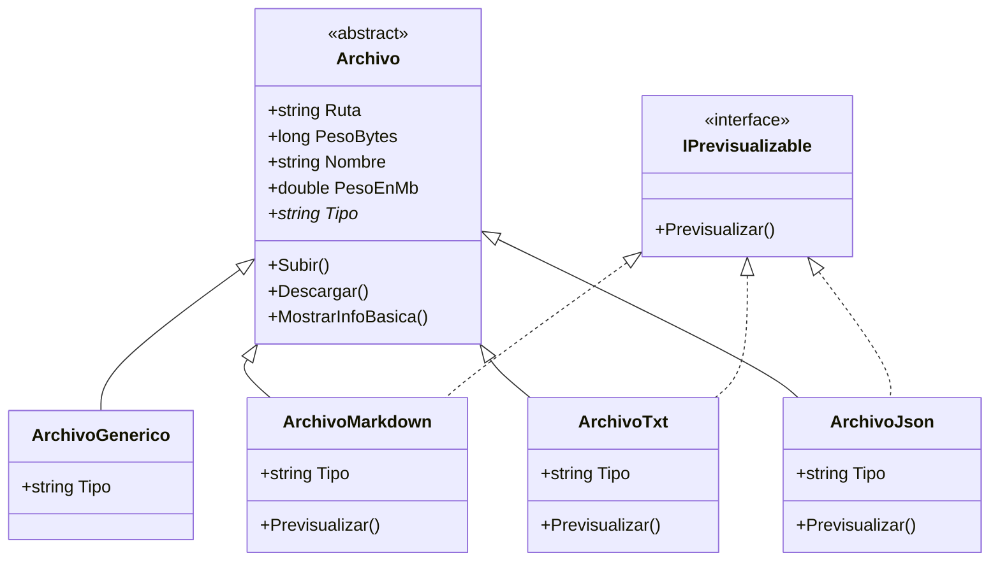
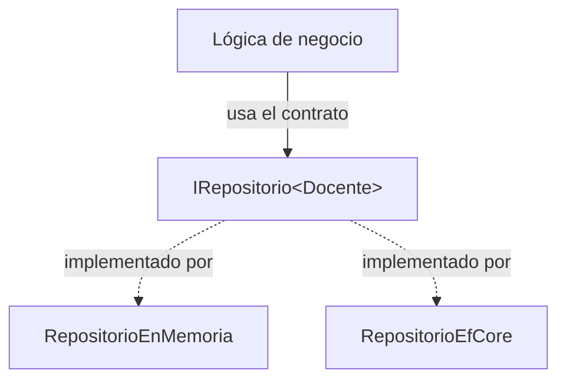

# Programación 3 2026 — Clase 17

## Unidad 5 · Interfaces y clases abstractas en acción: un previsualizador de archivos

> **.NET 8 · C# · Consola**

En la clase 15 vimos las **clases abstractas**: el molde que no se instancia y que comparte código entre subclases. En la clase 16 vimos las **interfaces**: el contrato puro que cualquier clase puede prometer cumplir, sin importar de qué herede. Hoy las usamos a las dos juntas, en el mismo programa, construyéndolo paso a paso desde cero.

La excusa para hacerlo va a ser un problema bien real: **cómo una aplicación de mensajería maneja los archivos que se suben**. Al final de la clase vas a tener una app de consola que imita ese comportamiento, y —más importante— vas a entender por qué una parte del diseño es una clase abstracta y la otra es una interfaz. Esa distinción es la que más cuesta al principio, y la única forma de fijarla es construyéndola.

---

## 1. La situación real: archivos en una app de mensajería

Pensá en WhatsApp, Telegram o Slack cuando mandás un archivo. Pasan dos cosas distintas según el archivo:

- Mandás una **imagen** o un **PDF** y la app te muestra una **vista previa**: una miniatura, las primeras líneas, algo del contenido sin tener que abrirlo.
- Mandás un **`.zip`**, un **`.exe`** o un archivo de un tipo raro y la app **no te muestra nada**: solo aparece el nombre, el peso, y un botón para descargar.

Si lo mirás con ojos de programador, la conclusión es interesante. **Todos** los archivos comparten un comportamiento básico: tienen un nombre, ocupan un peso, se suben y se descargan. Eso es común a todos, sin excepción. Pero **solo algunos** saben mostrar una vista previa. Los que no, son "el caso básico": subir y descargar, nada más. Los que sí, **agregan comportamiento por encima** del básico, un comportamiento especializado que depende del tipo de archivo (una imagen se previsualiza distinto que un PDF).

Esa frase —"todos comparten X, solo algunos agregan Y"— es exactamente la que hoy vamos a traducir a código. Y la traducción usa las dos herramientas que venimos viendo:

| Lo que observamos en la app | La herramienta de C# |
|---|---|
| Todo archivo se sube, se descarga y tiene peso (comportamiento común, con código real) | **Clase abstracta** `Archivo` |
| Solo algunos archivos saben previsualizarse (capacidad opcional) | **Interfaz** `IPrevisualizable` |

Lo vamos a construir en consola: el usuario escribe el nombre de un archivo, el programa lo "sube", muestra su info, y —**si el tipo de archivo lo permite**— muestra una vista previa. Para los `.md` mostramos los títulos; para los `.txt`, la cantidad de caracteres; para los `.json`, todas las keys. Para cualquier otra cosa, no hay preview.

---

## 2. El diseño antes de tocar el teclado

Antes de escribir una línea, dibujemos lo que vamos a hacer:



Fijate en dos cosas del diagrama:

1. **Las cuatro clases concretas heredan de `Archivo`** (flecha `<|--`). Todas *son* un archivo. Comparten el nombre, el peso, el subir y el descargar. Ese código se escribe **una sola vez** en `Archivo`.
2. **Solo tres implementan `IPrevisualizable`** (flecha `<|..`). `ArchivoGenerico` queda afuera: *es* un archivo, pero *no puede* previsualizarse. Esa es la diferencia entre "el caso básico" y "los que agregan comportamiento".

La pregunta del millón: **¿por qué `Previsualizar()` no va directamente en `Archivo`?** Porque si lo pusiéramos ahí, *todos* los archivos estarían obligados a tener una vista previa, incluido el genérico, que justamente no tiene ninguna. Tendríamos que inventarle una vista previa falsa o vacía. La interfaz nos deja decir con precisión: "esta capacidad la tienen **solo** los tipos que la implementan, y el resto ni se entera". Volvemos sobre esto al final, cuando ya esté funcionando.

Recordá la distinción de las clases anteriores, que acá se ve en vivo:

- **Clase abstracta** → relación **"es un"** + comparte código. `ArchivoMarkdown` **es un** `Archivo`.
- **Interfaz** → relación **"puede" / "cumple con"**. `ArchivoMarkdown` **puede** previsualizarse.

---

## 3. Crear el proyecto y los archivos de prueba

Creamos un proyecto de consola nuevo:

```bash
dotnet new console -n Previsualizador
cd Previsualizador
```

Como vamos a leer **archivos reales del disco**, necesitamos archivos de prueba. Creá estos tres en la carpeta del proyecto (al lado de `Program.cs`):

**`notas.md`**

```markdown
# Notas de la clase

Texto introductorio que no es un título.

## Interfaces

Algo de contenido.

### Detalle

Más contenido acá.

## Cierre

Última sección.
```

**`leeme.txt`**

```text
Este es un archivo de texto plano de ejemplo.
Tiene varias líneas para que el conteo de caracteres dé un número interesante.
Fin.
```

**`config.json`**

```json
{
  "nombreApp": "Mensajería",
  "version": "1.0.3",
  "maxArchivoMb": 16,
  "tiposPermitidos": ["md", "txt", "json", "png"],
  "notificaciones": true
}
```

Con eso ya tenemos un `.md`, un `.txt` y un `.json` para probar cada tipo de preview.

> **Nota — desde dónde corre el programa:** `dotnet run` ejecuta desde la carpeta del proyecto, así que cuando escribas `notas.md` lo va a buscar **ahí**. Por eso los archivos de prueba tienen que estar al lado de `Program.cs`. Si guardás un archivo en otro lado, escribí la ruta completa (por ejemplo `/home/usuario/Descargas/foto.png`). Si el programa dice "No encontré el archivo", casi siempre es esto.

---

## 4. La clase abstracta `Archivo` (lo común a todos)

Acá vive todo lo que **cualquier** archivo tiene, sin excepción. Creá el archivo `Archivo.cs`:

```csharp
namespace Previsualizador;

public abstract class Archivo
{
    public string Ruta { get; }
    public long PesoBytes { get; }

    protected Archivo(string ruta)
    {
        Ruta = ruta;
        PesoBytes = new FileInfo(ruta).Length;
    }

    public string Nombre => Path.GetFileName(Ruta);
    public double PesoEnMb => PesoBytes / (1024.0 * 1024.0);

    // Cada tipo de archivo dice qué es. No hay un valor por defecto razonable:
    // un "archivo genérico" no existe, siempre es de algún tipo concreto.
    public abstract string Tipo { get; }

    // Comportamiento COMÚN a todos los archivos.
    public void Subir() => Console.WriteLine($"[subir]     \"{Nombre}\" ({PesoEnMb:F2} MB)");
    public void Descargar() => Console.WriteLine($"[descargar] \"{Nombre}\"");

    public void MostrarInfoBasica()
    {
        Console.WriteLine($"  Tipo : {Tipo}");
        Console.WriteLine($"  Ruta : {Ruta}");
        Console.WriteLine($"  Peso : {PesoBytes} bytes ({PesoEnMb:F2} MB)");
    }
}
```

Repasemos parte por parte, porque cada decisión tiene un motivo:

- **`abstract class`**: no se puede hacer `new Archivo(...)`. Igual que la `Persona` de la clase 15: "un archivo" a secas no existe en el sistema, siempre es de un tipo concreto. El compilador nos lo impide.
- **El constructor lee el peso real del disco.** `new FileInfo(ruta).Length` devuelve el tamaño en bytes del archivo. Por eso necesitábamos archivos de verdad: el peso no es inventado.
- **`protected` en el constructor**: como nadie puede instanciar `Archivo` directamente, el constructor solo tiene sentido cuando lo llama una subclase. `protected` expresa justo eso.
- **`PesoEnMb` y `Nombre` son propiedades calculadas** (con `=>`): no guardan un dato, lo derivan en el momento. El nombre sale de la ruta con `Path.GetFileName`.
- **`public abstract string Tipo { get; }`**: una propiedad abstracta. Cada subclase está **obligada** a decir qué tipo es. Es el mismo mecanismo que el método abstracto `ObtenerRol()` de la clase 15, pero con una propiedad.
- **`Subir()`, `Descargar()` y `MostrarInfoBasica()` son concretos**: tienen implementación y las heredan todas las subclases. Este es el "comportamiento básico" del que hablábamos: subir y descargar lo hace cualquier archivo, igual.

> **Nota — por qué mostramos bytes y MB:** los archivos de prueba son chiquitos (unos cientos de bytes), así que en megabytes redondean a `0.00 MB`. Por eso `MostrarInfoBasica` muestra **también** los bytes: así el número nunca queda en cero. Si probás con un archivo grande de verdad (varios MB), vas a ver el valor en megabytes distinto de cero.

---

## 5. El primer archivo concreto: `ArchivoGenerico`

Empecemos por el caso más simple: el archivo **sin** vista previa. Es el equivalente al `.zip` que la app de mensajería solo te deja descargar. Creá `ArchivoGenerico.cs`:

```csharp
namespace Previsualizador;

// Un archivo que solo se puede subir y descargar. NO implementa IPrevisualizable:
// es como esos archivos que la app de mensajería deja mandar pero no previsualiza.
public class ArchivoGenerico : Archivo
{
    public ArchivoGenerico(string ruta) : base(ruta) { }

    public override string Tipo => "Archivo genérico";
}
```

Es mínima a propósito. Lo único que aporta sobre `Archivo` es:

- El constructor, que pasa la ruta a la clase base con `: base(ruta)`.
- La implementación obligatoria de `Tipo` (devuelve `"Archivo genérico"`).

No tiene `Previsualizar()` ni nada parecido, porque este archivo no se previsualiza. Y eso está perfecto: el `Subir()`, `Descargar()` y `MostrarInfoBasica()` los hereda gratis de `Archivo`.

---

## 6. El programa: subir y descargar (primera corrida)

Vamos a escribir un `Program.cs` que ya funcione, aunque todavía no sepa de previews. Por ahora trata **todo** como archivo genérico. Reemplazá el contenido de `Program.cs`:

```csharp
using Previsualizador;

Console.WriteLine("=== Mensajería: subida de archivos ===");
Console.WriteLine("Escribí la ruta de un archivo (o 'salir' para terminar).");

while (true)
{
    Console.Write("\nArchivo > ");
    string? entrada = Console.ReadLine();

    if (entrada is null) break;                       // fin de la entrada
    if (string.IsNullOrWhiteSpace(entrada)) continue;
    if (entrada.Trim().ToLower() == "salir") break;

    string ruta = entrada.Trim();

    if (!File.Exists(ruta))
    {
        Console.WriteLine($"  No encontré el archivo \"{ruta}\".");
        continue;
    }

    Archivo archivo = new ArchivoGenerico(ruta);

    archivo.Subir();              // común a todos los archivos
    archivo.MostrarInfoBasica();  // común a todos los archivos
    archivo.Descargar();
}

Console.WriteLine("\n¡Listo!");
```

Corré el programa:

```bash
dotnet run
```

Escribí `notas.md` y después `salir`. **Resultado esperado:**

```text
Archivo > notas.md
[subir]     "notas.md" (0.00 MB)
  Tipo : Archivo genérico
  Ruta : notas.md
  Peso : 163 bytes (0.00 MB)
[descargar] "notas.md"
```

Esto es el "caso básico" funcionando: subir, mostrar info, descargar. Cualquier archivo entra por acá. Ahora le agregamos el comportamiento especializado.

---

## 7. La interfaz `IPrevisualizable`: el contrato del previsualizador

Definimos el contrato que van a cumplir los archivos que saben previsualizarse. Creá `IPrevisualizable.cs`:

```csharp
namespace Previsualizador;

// El contrato del "previsualizador": cualquier archivo que lo implemente
// promete saber mostrar una vista previa de sí mismo en consola.
public interface IPrevisualizable
{
    void Previsualizar();
}
```

Una sola línea de contrato: "quien me implemente tiene que tener un método `Previsualizar()`". La interfaz no dice **cómo** se previsualiza —eso depende de cada tipo de archivo—, solo que **tiene que existir**.

> **Nota:** la interfaz no sabe nada de archivos. No menciona `Archivo`, ni rutas, ni pesos. Es una capacidad pura: "esto se puede previsualizar". Por eso podría aplicarse a cosas que ni son archivos. Esa independencia es la fuerza de las interfaces.

---

## 8. `ArchivoMarkdown` implementa el contrato

Ahora sí, el primer archivo con vista previa. Un `.md` se previsualiza mostrando solo sus **títulos** (las líneas que empiezan con `#`). Creá `ArchivoMarkdown.cs`:

```csharp
namespace Previsualizador;

public class ArchivoMarkdown : Archivo, IPrevisualizable
{
    public ArchivoMarkdown(string ruta) : base(ruta) { }

    public override string Tipo => "Documento Markdown";

    // Vista previa especializada: solo los títulos (líneas que empiezan con #).
    public void Previsualizar()
    {
        Console.WriteLine("  Vista previa (títulos):");
        string[] lineas = File.ReadAllLines(Ruta);
        var titulos = lineas.Where(l => l.TrimStart().StartsWith("#"));

        foreach (string titulo in titulos)
            Console.WriteLine($"    {titulo.Trim()}");
    }
}
```

Mirá la firma: `ArchivoMarkdown : Archivo, IPrevisualizable`. **Hereda de una clase y, además, implementa una interfaz**, separadas por coma. Esto es lo que vimos en la clase 16: una clase solo puede heredar de **una** clase base, pero puede implementar **todas las interfaces que quiera**.

- `: Archivo` → hereda nombre, peso, subir, descargar.
- `, IPrevisualizable` → se compromete a tener `Previsualizar()`. Si no lo escribimos, el compilador tira `CS0535`.

El método `Previsualizar()` lee el archivo con `File.ReadAllLines`, se queda con las líneas que arrancan con `#` usando LINQ (`Where`), y las imprime. Esa es la lógica especializada que un archivo genérico no tiene.

---

## 9. Enseñarle al programa a reconocer el contrato

Tenemos el contrato y un archivo que lo cumple. Falta que el programa **pregunte, en tiempo de ejecución, si el archivo se puede previsualizar**. Este es el corazón de toda la clase.

Primero, en vez de crear siempre un `ArchivoGenerico`, elegimos la subclase según la extensión. Agregá esta función al final de `Program.cs` (debajo del `Console.WriteLine("\n¡Listo!");`):

```csharp
// Según la extensión, devuelve la subclase de Archivo adecuada.
static Archivo CrearArchivo(string ruta)
{
    string extension = Path.GetExtension(ruta).ToLowerInvariant();

    return extension switch
    {
        ".md" => new ArchivoMarkdown(ruta),
        _ => new ArchivoGenerico(ruta)
    };
}
```

Y ahora cambiamos el cuerpo del `while`. Donde antes decía `new ArchivoGenerico(ruta)` y un `Descargar()` directo, lo dejamos así:

```csharp
    Archivo archivo = CrearArchivo(ruta);

    archivo.Subir();              // común a todos los archivos
    archivo.MostrarInfoBasica();  // común a todos los archivos

    // ¿Este archivo cumple el contrato IPrevisualizable?
    if (archivo is IPrevisualizable previsualizable)
    {
        previsualizable.Previsualizar();   // comportamiento especializado
    }
    else
    {
        Console.WriteLine("  (sin vista previa para este tipo de archivo)");
    }

    archivo.Descargar();
```

La línea clave es esta:

```csharp
if (archivo is IPrevisualizable previsualizable)
```

El operador `is` pregunta, **en tiempo de ejecución**, si el objeto que tenemos en la mano cumple el contrato `IPrevisualizable`. Si lo cumple, lo guarda en la variable `previsualizable` (ya con el tipo de la interfaz) y entra al `if`; si no, va al `else`. **Esto es exactamente lo que hace la app de mensajería**: agarra el archivo y se pregunta "¿este sabe mostrarse en miniatura?". Si sí, lo previsualiza; si no, muestra solo el botón de descarga.

Corré de nuevo (`dotnet run`) y probá `notas.md` y después `datos.dat` (creá cualquier archivo con esa extensión, o usá uno que tengas). **Resultado esperado:**

```text
Archivo > notas.md
[subir]     "notas.md" (0.00 MB)
  Tipo : Documento Markdown
  Ruta : notas.md
  Peso : 163 bytes (0.00 MB)
  Vista previa (títulos):
    # Notas de la clase
    ## Interfaces
    ### Detalle
    ## Cierre
[descargar] "notas.md"

Archivo > datos.dat
[subir]     "datos.dat" (0.00 MB)
  Tipo : Archivo genérico
  Ruta : datos.dat
  Peso : 31 bytes (0.00 MB)
  (sin vista previa para este tipo de archivo)
[descargar] "datos.dat"
```

El `.md` muestra los títulos; el `.dat` dice "sin vista previa". **Mismo código en el `while`, comportamiento distinto según el tipo real del objeto.** Eso es polimorfismo, y acá lo logramos con una interfaz, sin que los dos tipos tengan ninguna relación de herencia entre sí.

---

## 10. `ArchivoTxt`: contar caracteres

Agreguemos el segundo tipo con preview. Un `.txt` se previsualiza mostrando la **cantidad total de caracteres**. Creá `ArchivoTxt.cs`:

```csharp
namespace Previsualizador;

public class ArchivoTxt : Archivo, IPrevisualizable
{
    public ArchivoTxt(string ruta) : base(ruta) { }

    public override string Tipo => "Texto plano";

    // Vista previa especializada: cantidad total de caracteres.
    public void Previsualizar()
    {
        string texto = File.ReadAllText(Ruta);
        Console.WriteLine("  Vista previa (texto):");
        Console.WriteLine($"    Caracteres totales: {texto.Length}");
    }
}
```

Y sumamos su extensión al `switch` de `CrearArchivo`:

```csharp
    return extension switch
    {
        ".md" => new ArchivoMarkdown(ruta),
        ".txt" => new ArchivoTxt(ruta),
        _ => new ArchivoGenerico(ruta)
    };
```

---

## 11. `ArchivoJson`: mostrar las keys

El tercer tipo. Un `.json` se previsualiza mostrando **todas las keys** del objeto. Para leer JSON usamos `System.Text.Json`, que viene incluido en .NET. Creá `ArchivoJson.cs`:

```csharp
using System.Text.Json;

namespace Previsualizador;

public class ArchivoJson : Archivo, IPrevisualizable
{
    public ArchivoJson(string ruta) : base(ruta) { }

    public override string Tipo => "Documento JSON";

    // Vista previa especializada: todas las keys del objeto raíz.
    public void Previsualizar()
    {
        string texto = File.ReadAllText(Ruta);
        using JsonDocument documento = JsonDocument.Parse(texto);

        Console.WriteLine("  Vista previa (keys):");

        if (documento.RootElement.ValueKind == JsonValueKind.Object)
        {
            foreach (JsonProperty propiedad in documento.RootElement.EnumerateObject())
                Console.WriteLine($"    - {propiedad.Name}");
        }
        else
        {
            Console.WriteLine("    (el JSON no es un objeto con keys)");
        }
    }
}
```

Dos cosas nuevas que vale la pena notar:

- **`using System.Text.Json;`** arriba del archivo: es el espacio de nombres que trae las herramientas para leer JSON. No es un paquete extra, viene con .NET.
- **`using JsonDocument documento = ...`**: ese `using` (sin paréntesis, "declaración using") aparece porque `JsonDocument` implementa **`IDisposable`** —la interfaz que vimos en la clase 16—. Cuando la variable sale de alcance, se libera sola. Otra interfaz del framework trabajando para nosotros sin que la veamos.

Sumamos su extensión al `switch`:

```csharp
    return extension switch
    {
        ".md" => new ArchivoMarkdown(ruta),
        ".txt" => new ArchivoTxt(ruta),
        ".json" => new ArchivoJson(ruta),
        _ => new ArchivoGenerico(ruta)
    };
```

---

## 12. Probar los cuatro casos juntos

Corré el programa una última vez y pasale los tres archivos de prueba más uno genérico:

```bash
dotnet run
```

**Resultado esperado:**

```text
Archivo > notas.md
[subir]     "notas.md" (0.00 MB)
  Tipo : Documento Markdown
  Ruta : notas.md
  Peso : 163 bytes (0.00 MB)
  Vista previa (títulos):
    # Notas de la clase
    ## Interfaces
    ### Detalle
    ## Cierre
[descargar] "notas.md"

Archivo > leeme.txt
[subir]     "leeme.txt" (0.00 MB)
  Tipo : Texto plano
  Ruta : leeme.txt
  Peso : 133 bytes (0.00 MB)
  Vista previa (texto):
    Caracteres totales: 130
[descargar] "leeme.txt"

Archivo > config.json
[subir]     "config.json" (0.00 MB)
  Tipo : Documento JSON
  Ruta : config.json
  Peso : 154 bytes (0.00 MB)
  Vista previa (keys):
    - nombreApp
    - version
    - maxArchivoMb
    - tiposPermitidos
    - notificaciones
[descargar] "config.json"

Archivo > datos.dat
[subir]     "datos.dat" (0.00 MB)
  Tipo : Archivo genérico
  Ruta : datos.dat
  Peso : 31 bytes (0.00 MB)
  (sin vista previa para este tipo de archivo)
[descargar] "datos.dat"

Archivo > salir

¡Listo!
```

Tres tipos con vista previa, cada uno la suya; uno sin vista previa. Y el `while` del `Program.cs` **nunca pregunta de qué tipo es el archivo**: solo pregunta si cumple el contrato `IPrevisualizable`. Esa indiferencia es justo lo que buscábamos.

---

## 13. Qué acabamos de construir (y por qué cada herramienta es la correcta)

Paremos a mirar el diseño terminado, porque acá está toda la clase condensada.

**Por qué `Archivo` es una clase abstracta.** Porque las cuatro clases concretas **son** archivos y comparten código de verdad: el peso, el nombre, el subir, el descargar. Ese código se escribe una sola vez y se hereda. Y es abstracta porque "un archivo" a secas no existe: siempre es de un tipo. No tiene sentido hacer `new Archivo(...)`.

**Por qué `IPrevisualizable` es una interfaz.** Porque previsualizar es una **capacidad opcional**, no algo que defina lo que un archivo *es*. Algunos archivos la tienen, otros no. Y los que la tienen, no tienen nada más en común entre sí en cuanto a la previsualización: un Markdown y un JSON se previsualizan de maneras totalmente distintas. La interfaz captura "todos prometen tener `Previsualizar()`", sin imponer cómo.

**Por qué no metimos `Previsualizar()` dentro de `Archivo`.** Si lo hubiéramos puesto como método abstracto en `Archivo`, **todas** las subclases estarían obligadas a implementarlo, incluido `ArchivoGenerico`, que no tiene ninguna vista previa que mostrar. Lo tendríamos que llenar con un método vacío o falso. La interfaz nos deja que solo los tipos que de verdad pueden previsualizarse "opten" por la capacidad, y que el programa lo verifique con un simple `is`.

La tabla de la clase 16, ahora con nuestro ejemplo concreto:

| | Clase concreta | Clase abstracta | Interfaz |
|---|---|---|---|
| Ejemplo en este proyecto | `ArchivoMarkdown`, `ArchivoJson` | `Archivo` | `IPrevisualizable` |
| Se instancia con `new` | ✅ Sí | ❌ No | ❌ No |
| Aporta código compartido | ✅ Sí | ✅ Sí (subir, descargar, peso) | ❌ No (solo el contrato) |
| Relación que modela | "es un archivo concreto" | "es un archivo" | "puede previsualizarse" |
| ¿Cuántas se pueden tener? | — | 1 sola clase base | varias a la vez |

Y el detalle que cierra todo: el bloque

```csharp
if (archivo is IPrevisualizable previsualizable)
    previsualizable.Previsualizar();
```

es **mantenible y extensible**. El día que agregues `ArchivoPdf` o `ArchivoImagen`, si implementan `IPrevisualizable`, este `if` los previsualiza sin tocar una sola línea. Si no, caen en el `else` solos. Esto es el principio **Open/Closed** (abierto a extensión, cerrado a modificación) que nombramos la clase pasada, ahora visto funcionando: agregás tipos nuevos sin reescribir la lógica existente.

---

## 14. El proyecto completo

Estructura final de archivos:

```text
Previsualizador/
├── Archivo.cs            ← clase abstracta base
├── IPrevisualizable.cs   ← interfaz (el contrato del previsualizador)
├── ArchivoGenerico.cs    ← Archivo sin preview
├── ArchivoMarkdown.cs    ← Archivo + IPrevisualizable (títulos)
├── ArchivoTxt.cs         ← Archivo + IPrevisualizable (caracteres)
├── ArchivoJson.cs        ← Archivo + IPrevisualizable (keys)
└── Program.cs            ← el loop principal
```

`Program.cs` completo, tal como queda al final:

```csharp
using Previsualizador;

Console.WriteLine("=== Mensajería: subida de archivos ===");
Console.WriteLine("Escribí la ruta de un archivo (o 'salir' para terminar).");

while (true)
{
    Console.Write("\nArchivo > ");
    string? entrada = Console.ReadLine();

    if (entrada is null) break;                       // fin de la entrada
    if (string.IsNullOrWhiteSpace(entrada)) continue;
    if (entrada.Trim().ToLower() == "salir") break;

    string ruta = entrada.Trim();

    if (!File.Exists(ruta))
    {
        Console.WriteLine($"  No encontré el archivo \"{ruta}\".");
        continue;
    }

    Archivo archivo = CrearArchivo(ruta);

    archivo.Subir();              // común a todos los archivos
    archivo.MostrarInfoBasica();  // común a todos los archivos

    // ¿Este archivo cumple el contrato IPrevisualizable?
    if (archivo is IPrevisualizable previsualizable)
    {
        previsualizable.Previsualizar();   // comportamiento especializado
    }
    else
    {
        Console.WriteLine("  (sin vista previa para este tipo de archivo)");
    }

    archivo.Descargar();
}

Console.WriteLine("\n¡Listo!");

// Según la extensión, devuelve la subclase de Archivo adecuada.
static Archivo CrearArchivo(string ruta)
{
    string extension = Path.GetExtension(ruta).ToLowerInvariant();

    return extension switch
    {
        ".md" => new ArchivoMarkdown(ruta),
        ".txt" => new ArchivoTxt(ruta),
        ".json" => new ArchivoJson(ruta),
        _ => new ArchivoGenerico(ruta)
    };
}
```

---

## 15. Conexión con lo que viene: contratos para separar capas

El `if (archivo is IPrevisualizable previsualizable)` que escribimos hoy es, en chiquito, la misma idea que sostiene una arquitectura de software entera. El programa no depende de tipos concretos (`ArchivoMarkdown`, `ArchivoJson`): depende de un **contrato** (`IPrevisualizable`), y cualquier tipo que lo cumpla encaja sin tocar el resto del código.

En la clase 16 dejamos planteada una interfaz que íbamos a retomar: `IRepositorio<T>`, el corazón del **patrón Repository**. Ahora podés verla con otros ojos. Igual que `IPrevisualizable` le permite al programa trabajar con "cualquier cosa que se pueda previsualizar" sin saber su tipo concreto, `IRepositorio<Docente>` le va a permitir a la lógica de negocio trabajar con "algo que guarda y trae docentes" sin saber si atrás hay una lista en memoria, un archivo, o una base de datos con Entity Framework.



Esa es la puerta de entrada a la **Unidad 8 — Arquitectura en capas**: separar presentación, lógica de negocio y acceso a datos, usando interfaces como las fronteras entre capas. Lo que hoy practicaste con archivos —programar contra un contrato, no contra una implementación— es exactamente la herramienta que hace posible esa separación.

---

## Para practicar

Los ejercicios 1 al 7 son **obligatorios** y se construyen sobre el proyecto `Previsualizador` (estimado: 70–90 minutos). Los ejercicios 8 al 12 son **opcionales / desafío** para profundizar.

---

**1. Comprensión: ¿por qué interfaz y no clase abstracta?** *(~10 minutos, sin código)*

Explicá con tus palabras, en tres o cuatro oraciones, por qué `Previsualizar()` se definió en la interfaz `IPrevisualizable` y no como método abstracto dentro de `Archivo`. ¿Qué problema concreto aparecería con `ArchivoGenerico` si `Previsualizar()` estuviera en `Archivo`?

---

**2. Clasificación de diseño** *(~10 minutos, sin código)*

Para cada escenario, decidí si usarías una **clase concreta**, una **clase abstracta** o una **interfaz**, y justificá en una línea:

- a) `Notificacion`, `NotificacionEmail` y `NotificacionSms` comparten `Destinatario` y `Mensaje`, y cada una se envía distinto.
- b) Varios tipos sin relación entre sí (`Factura`, `Reporte`, `Ticket`) necesitan exponer un método `ImprimirPdf()`.
- c) `Usuario` es una entidad del sistema que se crea directamente con `new`.
- d) `ArchivoMarkdown` y `ArchivoJson` necesitan ambos poder "comprimirse" antes de subirse.

---

**3. Nuevo tipo con preview: `ArchivoCsv`** *(~15 minutos)*

Agregá una clase `ArchivoCsv` (extensión `.csv`) que herede de `Archivo` e implemente `IPrevisualizable`. Su vista previa debe mostrar la **cantidad de filas** (líneas del archivo) y la **cantidad de columnas** de la primera fila (separada por comas). Sumá `.csv` al `switch` de `CrearArchivo` y probalo con un archivo de ejemplo.

---

**4. El caso del archivo vacío** *(~10 minutos)*

¿Qué pasa si el `.md` no tiene ningún título? ¿Y si el `.txt` está vacío? Probá ambos casos y, si la vista previa queda fea o confusa, mejorala para que muestre un mensaje claro (por ejemplo, `"(sin títulos)"`). El contrato sigue cumpliéndose: `Previsualizar()` existe, solo cambia qué muestra.

---

**5. Segunda interfaz: `IComprimible`** *(~15 minutos)*

Definí una interfaz `IComprimible` con un método `void Comprimir()`. Hacé que `ArchivoJson` la implemente (que imprima algo como `"Comprimiendo JSON con gzip..."`). En el `while` de `Program.cs`, después de la vista previa, agregá un segundo chequeo:

```csharp
if (archivo is IComprimible comprimible)
    comprimible.Comprimir();
```

Comprobá que un `.json` ahora se previsualiza **y** se comprime, mientras que un `.md` solo se previsualiza. Una misma clase puede implementar **dos interfaces** a la vez.

---

**6. Ordenar los archivos subidos por peso** *(~15 minutos)*

Hacé que `Archivo` implemente `IComparable<Archivo>` (la interfaz de la clase 16), comparando por `PesoBytes`. Llevá una `List<Archivo>` con todos los archivos que se fueron subiendo durante la sesión, y al escribir `salir`, mostrá la lista ordenada de menor a mayor peso usando `Sort()`.

---

**7. Reusar `IExportable` de la clase 16** *(~10 minutos)*

Hacé que `Archivo` implemente también `IExportable` (de la clase 16), con `ExportarCsv()` devolviendo `nombre;tipo;bytes`. Antes de `salir`, exportá todos los archivos subidos a una sola cadena CSV y mostrala en consola. Notá que `Archivo` ahora implementa **dos** interfaces (`IComparable<Archivo>` e `IExportable`) además de ser abstracta.

---

**8. JSON inválido sin romper el programa** *(desafío — ~15 minutos)*

Pasale al programa un `.json` con sintaxis rota (por ejemplo, una llave sin cerrar). Vas a ver que `JsonDocument.Parse` lanza una excepción y el programa se cae. Envolvé la lectura en un `try/catch` que capture `JsonException` y muestre `"  (JSON inválido, no se puede previsualizar)"`. El contrato `IPrevisualizable` sigue cumpliéndose; lo que mejorás es la robustez.

---

**9. `is` vs cast directo** *(desafío — ~10 minutos, conceptual + código)*

Compará estas dos formas de usar la interfaz:

```csharp
if (archivo is IPrevisualizable p) p.Previsualizar();   // forma A
((IPrevisualizable)archivo).Previsualizar();            // forma B
```

Probá la forma B con un `ArchivoGenerico`. ¿Qué pasa? ¿Qué excepción salta? Explicá por qué la forma A es más segura y en qué situación usarías cada una.

---

**10. Filtrar solo los previsualizables con LINQ** *(desafío — ~15 minutos)*

Suponé que tenés una `List<Archivo>` con archivos de todos los tipos. Escribí un método `static void PrevisualizarTodos(List<Archivo> archivos)` que use `archivos.OfType<IPrevisualizable>()` para quedarse **solo** con los que cumplen el contrato y previsualizarlos. Investigá qué hace `OfType<T>()` y por qué es ideal acá.

---

**11. Vista previa de Markdown por nivel** *(desafío — ~15 minutos)*

Mejorá la vista previa de `ArchivoMarkdown` para que, además de listar los títulos, muestre un conteo: cuántos títulos de nivel 1 (`#`), de nivel 2 (`##`) y de nivel 3 (`###`) tiene el documento.

---

**12. Integrador: el dispatcher crece** *(desafío — ~20 minutos, conceptual + código)*

Cada vez que agregamos un tipo de archivo, tocamos el `switch` de `CrearArchivo`. Discutí: ¿es esto una violación del principio Open/Closed? ¿Por qué la **lógica del `while`** sí está cerrada a modificación pero la **fábrica `CrearArchivo`** no? Investigá brevemente el patrón **Factory** y escribí, en un comentario al final de tu `Program.cs`, una idea de cómo se podría evitar tocar el `switch` al sumar tipos nuevos. (No hace falta implementarlo: alcanza con la reflexión y el boceto.)
