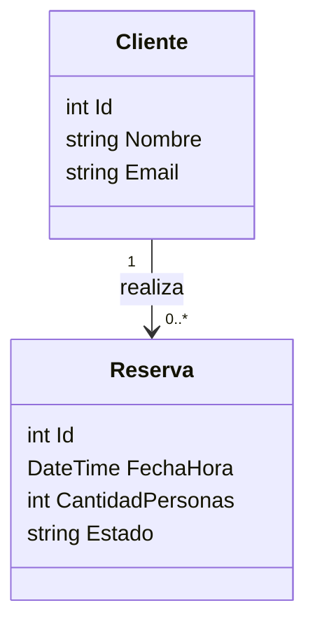
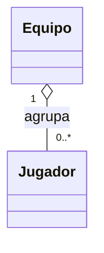
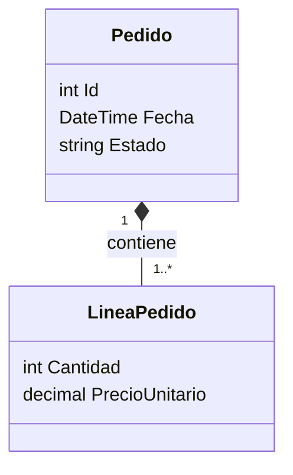
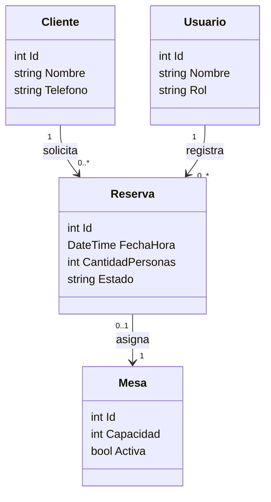

# Programacion 3 2026
## Clase 6.5

# Hoy

- Clase puente entre el bloque de IA y el bloque de analisis/diseno
- Pensar problemas de negocio de forma estructurada
- Diferenciar **sintomas** de **problema real**
- Identificar actores, procesos y entidades del dominio
- Diagramas de clase: clases, relaciones, cardinalidad basica, agregacion y composicion
- Primera mirada a capas y MVC como forma de ordenar una solucion

Esta clase no es para "dibujar por dibujar". La idea es aprender a mirar una situacion de negocio, ordenar lo que pasa y recien despues pensar que sistema conviene construir. Un buen diagrama no reemplaza el analisis: lo hace visible.

---

# Venimos de aca

- Unidad 3: tests, refactorizacion y documentacion con IA
- Ya vimos que la IA puede acelerar, pero tambien inventar o simplificar de mas
- Antes de pedir codigo, necesitamos entender **que problema estamos resolviendo**

Si el diagnostico esta mal, el codigo puede estar perfecto y aun asi no servir. Programar bien empieza antes del `dotnet new`: empieza entendiendo el negocio.

---

# Por que esta clase

En el integrador van a hablar con docentes que representan empresas ficticias. Esas empresas no siempre van a pedir "una pantalla", "una tabla" o "un endpoint" de forma ordenada. Van a contar dolores, urgencias, perdidas de tiempo, errores, quejas o procesos manuales.

El trabajo de ustedes es transformar eso en:

- Problema claro
- Actores involucrados
- Procesos actuales
- Reglas de negocio
- Entidades importantes
- Solucion posible
- Alcance razonable

La IA puede ayudar a ordenar notas, pero no puede reemplazar las preguntas correctas.

---

# Sintoma vs problema real
## No son lo mismo

Un **sintoma** es lo que se ve:

- "Los clientes se quejan"
- "Hay muchas planillas"
- "Se pierden reservas"
- "El stock nunca coincide"
- "Demoramos mucho en confirmar pedidos"

El **problema real** suele estar mas abajo:

- No hay una fuente unica de informacion
- El proceso depende de una sola persona
- No existen estados claros
- Las reglas estan en la cabeza de alguien
- Hay doble carga de datos
- Nadie valida entradas antes de guardar

Si atacamos solo el sintoma, hacemos software que maquilla el problema. Si entendemos la causa, podemos proponer una solucion con impacto.

---

# Ejemplo simple
## "Necesitamos una app"

Frase del negocio:

```text
Necesitamos una app porque las reservas son un caos.
```

Preguntas:

- Que significa "caos"?
- Se pierden reservas o se duplican?
- Falta cupo real o falta visibilidad?
- Quien toma la reserva?
- Quien la confirma?
- Donde se guarda hoy?
- Que pasa si el cliente cancela?
- Que dato se necesita para decidir si hay lugar?

La app no es el problema. La app es una posible solucion. Primero hay que entender el proceso.

---

# Camino de analisis
## Paso a paso

Una forma ordenada de trabajar:

1. Escuchar la situacion sin saltar a la solucion
2. Separar sintomas, causas posibles y restricciones
3. Identificar actores involucrados
4. Mapear procesos actuales
5. Encontrar entidades del dominio
6. Detectar reglas de negocio
7. Priorizar soluciones por impacto y esfuerzo
8. Recien despues, pensar pantallas, clases, base de datos o APIs

Este camino evita construir "lo que se nos ocurrio primero" y ayuda a defender decisiones.

---

# Actores
## Quienes participan

Un actor no siempre es una persona fisica. Puede ser:

- Cliente
- Administrador
- Vendedor
- Encargado
- Sistema externo
- Pasarela de pago
- Servicio de notificaciones

Para identificar actores, pregunten:

- Quien inicia el proceso?
- Quien necesita ver informacion?
- Quien aprueba o rechaza?
- Quien carga datos?
- Quien recibe el resultado?
- Que sistema externo participa?

En casos de uso, los actores nos ayudan a no olvidarnos de usuarios reales ni de integraciones.

---

# Procesos
## Que ocurre en el negocio

Un proceso es una secuencia de pasos con un objetivo:

- Registrar una reserva
- Confirmar un pedido
- Actualizar stock
- Asignar tecnico
- Emitir factura
- Cancelar turno

Para entender un proceso:

- Inicio: que evento lo dispara?
- Entrada: que datos necesita?
- Reglas: que condiciones debe cumplir?
- Salida: que cambia cuando termina?
- Excepciones: que pasa si algo falla?

Si no pueden explicar el proceso en palabras, probablemente todavia no conviene dibujar clases.

---

# Entidades del dominio
## Sustantivos importantes

Las entidades suelen aparecer como sustantivos del negocio:

- Cliente
- Reserva
- Mesa
- Turno
- Pedido
- Producto
- Pago
- Usuario

Pero cuidado: no todo sustantivo merece una clase. Una clase aparece cuando necesitamos guardar datos, comportamiento, reglas o relaciones importantes.

Ejemplo:

- `Reserva` seguramente es clase si tiene fecha, estado, cliente, cantidad de personas y reglas de cancelacion.
- "Boton confirmar" no es clase de dominio; es un elemento de interfaz.

---

# Diagrama de clases
## Para que sirve

Un diagrama de clases muestra:

- Clases principales del dominio
- Atributos importantes
- Relaciones entre clases
- Multiplicidades o cardinalidades
- Responsabilidades basicas

No hace falta dibujar todo desde el primer dia. Conviene empezar por el dominio central y agregar detalle cuando el problema lo justifique.

---

# Cardinalidad basica
## Cuantos con cuantos

La cardinalidad responde "cuantos objetos de un tipo se relacionan con cuantos del otro".

Notacion comun:

- `1`: exactamente uno
- `0..1`: cero o uno
- `*`: muchos
- `0..*`: cero o muchos
- `1..*`: uno o muchos

Ejemplos:

- Un `Cliente` puede tener muchas `Reserva`.
- Una `Reserva` pertenece a un `Cliente`.
- Un `Pedido` tiene una o muchas `LineaPedido`.
- Una `LineaPedido` corresponde a un `Producto`.

La cardinalidad obliga a pensar reglas: puede existir una reserva sin cliente? Un pedido sin lineas? Un producto sin stock?

---

# Ejemplo Mermaid
## Cliente y Reserva



Lectura: un cliente puede realizar cero o muchas reservas; cada reserva queda asociada a un cliente.

---

# Agregacion
## Tiene, pero puede vivir separado

La **agregacion** representa una relacion "tiene un", donde la parte puede existir por separado del todo.

Ejemplo conceptual:

- Un `Equipo` tiene `Jugador`.
- Si el equipo se elimina del sistema, el jugador podria seguir existiendo.

En UML suele representarse con rombo blanco.



Usen agregacion cuando la relacion indica pertenencia debil o agrupacion, no propiedad absoluta.

---

# Composicion
## Parte fuerte del todo

La **composicion** representa una relacion mas fuerte: la parte depende del todo.

Ejemplo tipico:

- Un `Pedido` esta compuesto por `LineaPedido`.
- Una linea de pedido no tiene sentido sin el pedido al que pertenece.

En UML se representa con rombo negro.



Pregunta clave: si borro el todo, la parte sigue teniendo sentido como objeto independiente? Si no, probablemente sea composicion.

---

# Asociacion simple
## No todo es agregacion o composicion

Muchas relaciones son simplemente asociaciones:

- Un `Usuario` crea una `Reserva`
- Un `Producto` pertenece a una `Categoria`
- Un `Tecnico` atiende un `Ticket`

No conviene forzar agregacion o composicion si solo queremos indicar que dos clases se conocen o colaboran. Primero claridad, despues precision.

---

# Errores comunes en diagramas

- Poner pantallas como clases de dominio
- Dibujar todas las tablas antes de entender reglas
- Usar muchas flechas sin poder explicarlas
- Confundir "lista en pantalla" con relacion de negocio
- Omitir cardinalidad porque "se entiende"
- Creer que el primer diagrama es definitivo

Un diagrama es una herramienta de conversacion. Si al mostrarlo aparecen preguntas mejores, el diagrama ya sirvio.

---

# Capas
## Ordenar responsabilidades

Una aplicacion suele separarse en responsabilidades:

- **Presentacion:** recibe interaccion del usuario y muestra resultados
- **Dominio o negocio:** reglas, validaciones y decisiones importantes
- **Acceso a datos:** guardar y recuperar informacion
- **Integraciones:** comunicacion con sistemas externos o APIs

Separar capas no es burocracia. Es una forma de evitar que todo quede mezclado en un archivo imposible de mantener.

---

# MVC
## Primera mirada

MVC significa:

- **Model:** datos y conceptos que la aplicacion maneja
- **View:** lo que el usuario ve
- **Controller:** recibe pedidos, coordina acciones y decide que respuesta devolver

En ASP.NET Core MVC, un flujo tipico:

1. El usuario entra a una URL o envia un formulario
2. El `Controller` recibe la solicitud
3. El controller usa servicios o logica de negocio
4. Se consultan o guardan datos si hace falta
5. Se devuelve una `View` o una respuesta

Mas adelante vamos a profundizar. Por ahora alcanza con entender que MVC ayuda a separar pantalla, coordinacion y datos.

---

# MVC y capas
## No mezclar todo

Un error comun:

- Controller con SQL directo
- View con reglas de negocio
- Model usado como bolsa de cualquier dato
- Validaciones copiadas en muchos lugares

Mejor idea:

- Controller coordina
- Servicio aplica reglas
- Repositorio o acceso a datos persiste
- View muestra

Aunque todavia no implementemos Repository o Unit of Work, el criterio de separacion empieza ahora.

---

# Impacto vs esfuerzo
## Elegir que resolver primero

No toda solucion vale lo mismo. Para priorizar:

- **Alto impacto, bajo esfuerzo:** hacer primero
- **Alto impacto, alto esfuerzo:** planificar y dividir
- **Bajo impacto, bajo esfuerzo:** hacer si no distrae
- **Bajo impacto, alto esfuerzo:** evitar o postergar

Ejemplo:

- Validar que una reserva no sea en fecha pasada: alto impacto, bajo esfuerzo
- Sistema de recomendaciones con IA: puede ser interesante, pero tal vez alto esfuerzo y no resuelve el dolor principal

El integrador necesita creatividad, pero tambien foco.

---

# Uso de IA en esta etapa
## Bueno y malo

Buen uso:

- "Ordena estas notas en sintomas, problemas, actores y procesos"
- "Propone preguntas para entrevistar al cliente"
- "Genera un primer diagrama Mermaid a partir de estas reglas"
- "Detecta ambiguedades en esta especificacion"

Mal uso:

- "Inventame el negocio completo"
- "Hace el diagrama final sin hacer preguntas"
- "Decidi que sistema necesita la empresa" sin contexto
- Copiar clases, actores o procesos que nadie valido

La IA puede ayudar a pensar, pero el analisis requiere contraste con la realidad del negocio.

---

# Plantilla de analisis
## Para copiar y usar

```text
# Analisis inicial

## Situacion
[Que cuenta el negocio]

## Sintomas
- 

## Problema real probable
- 

## Actores
- 

## Procesos involucrados
- 

## Entidades del dominio
- 

## Reglas de negocio
- 

## Preguntas pendientes
- 

## Soluciones posibles
- 

## Mayor impacto / menor esfuerzo
- 
```

Esta plantilla puede vivir en `ia_docs` o en la documentacion de analisis del equipo.

---

# Actividad principal
## Caso: reservas

Situacion:

```text
Un restaurante recibe reservas por telefono, Instagram y WhatsApp.
A veces dos personas anotan reservas al mismo tiempo en planillas distintas.
Los clientes se quejan porque llegan y no hay mesa.
El encargado quiere "una app para reservas".
```

Trabajo:

1. Separar sintomas y problema real probable
2. Identificar actores
3. Listar procesos involucrados
4. Extraer entidades del dominio
5. Proponer reglas de negocio
6. Dibujar un diagrama de clases inicial en Mermaid
7. Proponer una solucion de alto impacto y bajo esfuerzo

---

# Diagrama inicial posible
## No definitivo



Preguntas que quedan:

- Una reserva puede existir sin mesa asignada?
- Una reserva puede ocupar mas de una mesa?
- Como se representa una cancelacion?
- Hay turnos fijos o cualquier horario?
- Que pasa con reservas duplicadas?

---

# Cierre

- El sintoma no siempre es el problema
- Antes de clases y tablas, hay actores, procesos y reglas
- La cardinalidad revela decisiones de negocio
- Agregacion y composicion ayudan a expresar dependencia entre objetos
- MVC y capas ordenan responsabilidades para que la solucion sea mantenible
- La mejor solucion no siempre es la mas grande: buscamos impacto alto con esfuerzo razonable

---

# Lo que sigue

- Comparacion de modelos y cierre del bloque IA
- Luego Unidad 5: POO, casos de uso, interacciones, diagramas y especificacion
- Vamos a usar IA para apoyar el analisis, pero siempre validando contra el negocio
